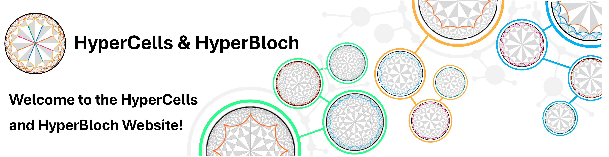

# The HyperCells & HyperBloch website

<figure class="text-center">
  <picture> 
    <source type="image/svg+xml" srcset="./_static/images/lightMode/TitleFigure2_light.png">
    
  </picture>
</figure>

>**HyperCells** is a |GAP| package which enables the construction of graphs underlying tight-binding models 
on infinite and compactified hyperbolic lattices on primitive cells and supercells based on triangle groups 
and quotients with normal subgroups.

>**HyperBloch** is a |Mathematica| package for the construction of the corresponding Bloch Hamiltonian, its
eigenstates, and spectrum based on Abelian hyperbolic band theory. It enables advanced visualizations of
hyperbolic lattices and graphs of underlying tight-binding models on the Poincaré disk model.