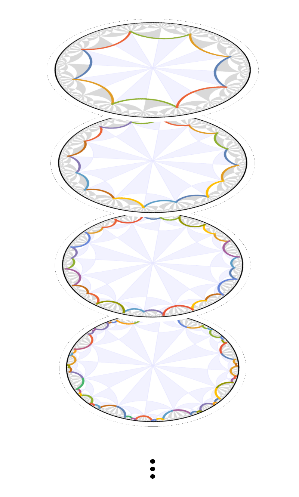

.. raw:: html

  

.. _about:

About
======

Construction of hyperbolic lattices
^^^^^^^^^^^^^^^^^^^^^^^^^^^^^^^^^^^

When constructing cell, model and supercell model graphs, **HyperCells** does not only provide
the graph itself but includes a lot of additional information.
This includes:

* labels for the Schwarz triangles as elements of the (proper) triangle group
* labels for the vertices (or maximally symmetric Wyckoff positions) in terms of the label for the
  corresponding Schwarz triangle and which of the vertices of the Schwarz triangle it is
* labels for the edges in terms how they are obtained, e.g., Schwarz triangle, vertex of an underlying cell graph, etc.
* translation associated with each edge in the graph, i.e., which unit cells it connects
* oriented faces of the cell graph
* unit-cell boundary segments and their identification for periodic boundary conditions

.. |HyperCells documentation| raw:: html

   <a href="https://patrick-lenggenhager.github.io/HyperCells/doc/chap0_mj.html" target="_blank">documentation</a>

For supercell graphs, the embedding of the primitive cell graph and the corresponding homomorphism
between the translation groups are also provided.
For more details, see the |HyperCells documentation| of the package.

The supercell method
^^^^^^^^^^^^^^^^^^^^

Models defined on hyperbolic lattices can be theoretically described by a non-Abelian generalization 
of the Bloch theorem.
However, practical approaches for directly constructing the associated Bloch states are still
lacking.
The **supercell method** overcomes the challenges posed by noncommuting translations by deducing
the Bloch states from the Abelian Bloch states obtained on  a sequence of progressively larger
symmetric supercells.
This enables significant progress towards an analytical description of hyperbolic lattice models
in momentum space.
Application of this method is greatly simplified by our two software packages, *HyperCells*
and *HyperBloch*.

.. |Phys. Rev. Lett. 131, 226401 (2023)| raw:: html

   <a href="https://doi.org/10.1103/PhysRevLett.131.226401" target="_blank">Phys. Rev. Lett. 131, 226401 (2023)</a>

.. |PhD thesis| raw:: html

   <a href="https://doi.org/10.3929/ethz-b-000645370" target="_blank">PhD thesis</a>

.. |space| unicode:: U+2064 .. space

.. raw:: html
  
  
  <link rel="preload" href="../../_static/images/darkMode/SuperCells2_dark.png" as="image">

We use computational group theory to create a sequence of progressively larger unit
cells, each formed as a symmetric aggregate of smaller unit cells. Subsequently, we apply the previously 
established Abelian hyperbolic band theory — which ignores the noncommutativity of translations — to those 
growing supercells and obtain a converging description of the infinite lattice. The method was introduced in
|Phys. Rev. Lett. 131, 226401 (2023)|. Practically, we need to perform the following steps:

| |space| |space| |space| 1. |space| |space| construct the lattice and model graph on the primitive (unit) cell,
| |space| |space| |space| 2. |space| |space| construct the supercell graph relating the model on the primitive cell
| |space| |space| |space| |space| |space| |space| |space| |space| |space| to the model on the supercell,
| |space| |space| |space| 3. |space| |space| set up the tight-binding model in real space on the primitive cell, and
| |space| |space| |space| 4. |space| |space| construct the (Abelian) Bloch Hamiltonian.

An introduction to the topic in general and these steps specifically (using worked-out examples),
can be found in Dr. Patrick M. Lenggenhager's |PhD thesis|.

Visualization with HyperBloch
^^^^^^^^^^^^^^^^^^^^^^^^^^^^^

In order to simplify working with hyperbolic lattices, in particular defining tight-binding
models, the **HyperBloch** Mathematica package provides several visualization tools.
These include tools for visualizing the lattice, high-symmetry positions (maximally symmetric
Wyckoff positions), specific vertices, edges, faces, as well as symmetry operations and unit cells.

The tutorials will introduce most of this functionality and a complete overview can be found
in the documentation of the package, i.e., in the Mathematica help center.