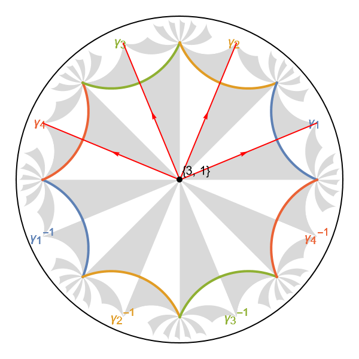
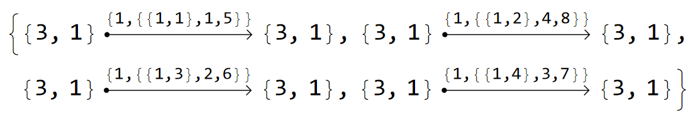
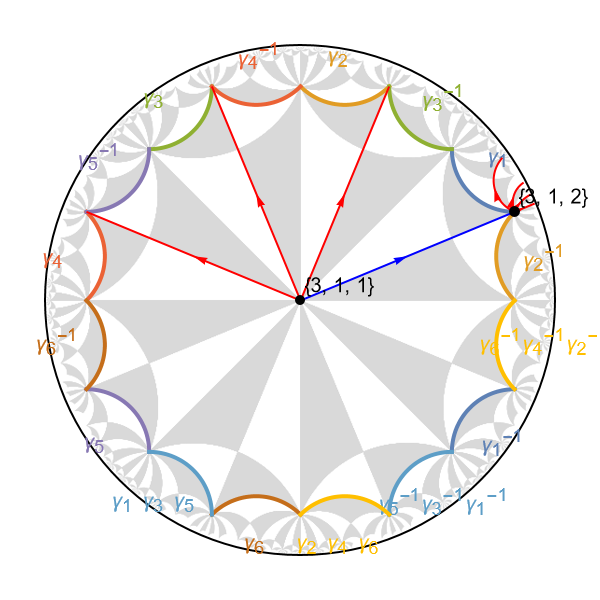
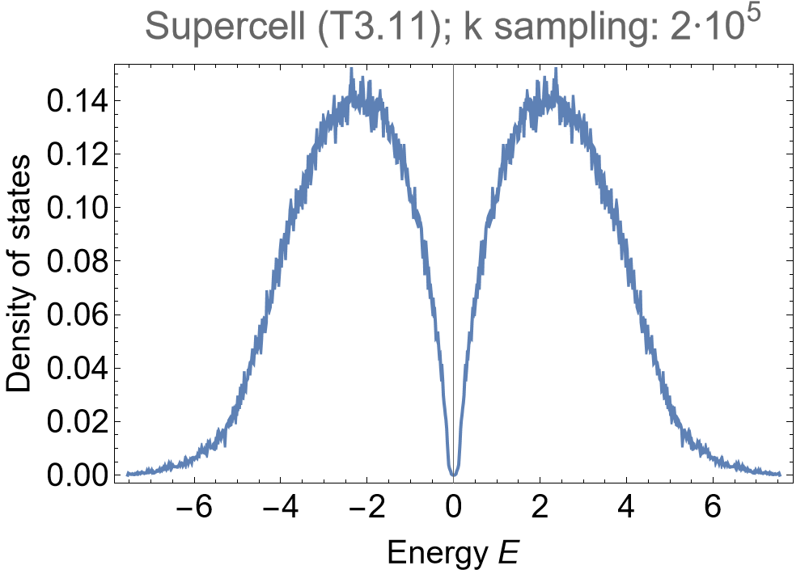

# HyperBloch

```{admonition} Learning goals
:class: hint

Import of:

* <code class="code-gap" style="font-size:1.1em;">TGCellGraph</code>,
* <code class="code-gap" style="font-size:1.1em;">TGCellModelGraph</code>
* and <code class="code-gap" style="font-size:1.1em;">TGSuperCellModelGraph</code> files.

Visualization of:

* graph representation on a primive cell,
* graph representation on a supercell and

construction of:

* corresponding **Abelian Bloch Hamiltonian**.

```

Aspects of the content below originate from the  <a target="_blank" href="https:/doi.org/10.5281/zenodo.10142167">Supplementary Data and Code</a>, 
where the necessary steps to find the **density of states** of an elementary nearest-neighbor hopping model on the {8,8}-lattice are discussed 
in more depth.


## Prerequisits **in GAP**

In order to construct the Bloch Hamiltonian for a nearest-neighbor tight-binding model on the {8,8}-lattice, we need to create the necessary files 
using the **HyperCells** package in GAP. We first construct the primitive cell and the model graph (based on the tessellation graph), 
and finally the 2-supercell, as we have established previously in getting started with [HyperCells](./getSetGo_HyperCells):

```gap
# load the HyperCells package
LoadPackage( "HyperCells" );

# set up (proper) triangle group
tg := ProperTriangleGroup( [ 2, 8, 8 ] );

# Primitive cell:
# ---------------

# specify the quotient defining the primitive cell
qpc := TGQuotient( [ 2, 6 ] );

# construct symmetric primitive cell
cgpc := TGCellGraph( tg, qpc, 3 : simplify := 5 );
Export( cgpc, "(2,8,8)_T2.6_3.hcc" ); # export

# elementary nearest-neighbor model
model := TessellationModelGraph( cgpc, true : simplify := 5 );
Export( model, "{8,8}-tess_T2.6_3.hcm" ); # export

# Supercell:
# ----------

# specify the quotient defining the supercell cell
qsc := TGQuotient( [ 3, 11 ] );

# construct symmetric supercell
cgsc := TGCellGraph( tg, qsc, 3 : simplify := 2 );
Export( cgsc, "(2,8,8)_T3.11_3.hcc" );

# construct symmetric supercell
sc := TGCellSymmetric( tg, qsc, 3 );

# extend the model defined on the primitive cell to the supercell
scmodel := TGSuperCellModelGraph( model, sc : simplify := 0 );
Export( scmodel, "{8,8}-tess_T2.6_3_sc-T3.11.hcs" ); # export
```

<div class="flex ">
  <a href="../../../source/assets/misc/code_snippets/GettingStarted/getting_started_HyperCells_pc_sc_files.zip" download class="btn btn-primary" class="flex-child">Download generated files</a>
  <a href="../../../source/assets/misc/code_snippets/GettingStarted/getting_started_HyperCells.g" download class="btn btn-primary" class="flex-child">Download GAP Code</a>
</div>


## Hands-on **in Mathematica**

Next, in Mathematica, we load the **HyperBloch** package

```Mathematica
<< PatrickMLenggenhager`HyperBloch`
```

and then the exported data:

```Mathematica
SetDirectory[NotebookDirectory[]];

pcell = ImportCellGraphString[Import["(2,8,8)_T2.6_3.hcc"]];
pcmodel = ImportModelGraphString[Import["{8,8}-tess_T2.6_3.hcm"]];
```

Note the use of the <code class="language-Mathematica">Import[]</code> function inside the <code class="language-Mathematica">ImportCellGraphString[]</code> 
function. This is necessary, because the exported file is a text file, which contains the string representation of the cell graph. The 
<code class="language-Mathematica">Import[]</code> function is used to read the file, while the <code class="language-Mathematica">ImportCellGraphString[]</code> 
function is used to parse the string and construct the cell graph. Alternatively, we could have used the function 
<code class="language-gap">ExportString()</code> in GAP to export the cell graph as a string, copied the string into a Mathematica notebook, 
and then used the <code class="language-Mathematica">ImportCellGraphString[]</code> function (or one of the analogous functions) directly to parse the
 string and construct the cell graph.

The HyperBloch package provides convenient functions for visualizing the model:

```Mathematica
VisualizeModelGraph[pcmodel,
	Elements -> <|
		ShowCellGraphFlattened -> {},
		ShowCellBoundary -> {ShowEdgeIdentification -> True}
	|>,
	CellGraph -> pcell,
	NumberOfGenerations -> 2,
	ImageSize -> 300
]
```

producing a figure of an elementary nearest-neighbor model on the {8,8} lattice:

<figure class="text-center">
  <picture>
    <source type="image/svg+xml" srcset="../../../source/assets/media/figs/getSetGoHyperBloch/ENNM_88.png">
    
  </picture>
</figure>

In order to construct the **Abelian Bloch Hamiltonian**, we need to assign the parameters to vertices and edges in the model graph. This takes a very compact form for a simple nearest neighbour tight-binding model. In order to illustrate the procedure, we will start with the most general assignment strategy and demonstrate the compact form afterwards. On a first read one may want to skip the subsection General strategy and resume at subsection [Compact strategy](#compact-strategy).

### General strategy

The HyperBloch package supports the construction of models with **multiple orbits per site** and allows for different numbers of orbitals per site as well. For now, we will set the number of orbitals to one. The assignement of  multiple orbitals per site are  discussion in the tutorial (???).

```Mathematica
norbits = 1;
```

**Onsite** terms in the Hamiltonian are associated with vertices in the model graph. It is useful to explicitly  print the vertices using the VertexList (href ??) function of Mathematica:

```Mathematica
VertexList@pcmodel["Graph"]
```

There is only one site residing in the primitive cell, as such the vertex list contains only one entry ``{{3, 1}}``.
 
We will set the onsite terms to zero by associating the vertices with a zero vector:

```Mathematica
mVec = ConstantArray[0, 1]; 
onsitePC = AssociationThread[VertexList@pcmodel["Graph"] -> mVec];
```

The hopping terms for nearest neighbor interactions are associated with edges in the model graph. Similarly to the onsite terms, it is useful to explicitly print the edges using  EdgeList function of Mathematica: 

```Mathematica
EdgeList@pcmodel["Graph"]
```

which returns four edges:

<figure class="text-center">
  <picture>
    <source type="image/svg+xml" srcset="../../../source/assets/media/figs/getSetGoHyperBloch/EdgeListPC88.png">
    
  </picture>
</figure>

Each element in the list is a DirectedEdge, describing an association of pairs of vertices with one another. More concretely, the nested list above the arrows of the form  ``{1, {ve, s1, s2}}`` consist of entries which identify the position of the edge within the primitive cell (see HCModelGraph href ????).

It might also be helpful to look at the translation operators associated with the edges:

```Mathematica
pcmodel["EdgeTranslations"]
```

which contains four translation operators ``{g1, g4, g2, g3}``. We will now set the hopping terms to a constant real value <code class="language-Mathematica">1</code> for all edges by associating the edge list with a list of constant values. 

```Mathematica
nnHoppingVec = ConstantArray[1, 4];
hoppingPC = AssociationThread[EdgeList@pcmodel["Graph"] -> nnHoppingVec];
```

The Hamiltonian can now be set up by specifying the model graph and the corresponding coupling constants specified above. 

```Mathematica
Hpc = AbelianBlochHamiltonian[pcmodel, norbits, onsitePC,hoppingPC]
```

which results in a function of four momenta:

```Mathematica
{ { -2 (Cos[k[1]] + Cos[k[2]] + Cos[k[3]] + Cos[k[4]]) } }
```

### Compact strategy

The simplicity of the specified model reduces the construction of the Hamiltonian to just one line of code. Once again we set the number of orbitals per site in the second argument to 1, the onsite hopping amplitude to 0 and the nearest-neighbor coupling to -1:

```Mathematica
Hpc = AbelianBlochHamiltonian[pcmodel, 1, 0 &, -1 &];
```

For more efficient evaluation, we precompile the Bloch Hamiltonian
 by specifying the option <code class="language-Mathematica">CompileFunction->True</code>:

```Mathematica
Hpc = AbelianBlochHamiltonian[pcmodel, 1, 0 &, -1 &, CompileFunction -> True];
```
To compute the **density of states** (DOS), we can now take advantage of the independence of different momentum sectors and therefore parallelize it:

```Mathematica
ComputeEigenvalues[cfH_, Npts_, Nruns_] := 
 Module[{dimk = Length[cfH[[2]]]},
  Flatten @ ParallelTable[
    Flatten @ Table[
      Eigenvalues[cfH @@ RandomReal[{-Pi, Pi}, dimk]], {i, 1, 
       Round[Npts/Nruns]}],
    {j, 1, Nruns}, Method -> "FinestGrained"]]

evspc = ComputeEigenvalues[Hpc, 10^6, 32];
```

We find the density of states of the elementary nearest-neighbor model on the primitive cell <code class="code" style="font-size:1.1em;">T2.6</code> of the {8,8}-lattice:

```Mathematica
SmoothHistogram[evspc, 0.005, "PDF", Frame, -> True, FrameStyle -> Black,
                PlotRange -> All, LableStyle -> 20, ImageSize -> 500,
                ImagePadding ->{{Automatic, 10},{Automatic}},
                PlotLabel -> "Primitive cell (T2.6); k sampling: 10^6",
                FrameLabel -> {"Energy E", "Density of states"}]
```

<figure class="text-center">
  <picture>
    <source type="image/svg+xml" srcset="../../../source/assets/media/figs/getSetGoHyperBloch/dos_88_T2.6.png">
    
  </picture>
</figure>

We proceed by following an analogous methodology for the 2-supercell. Instead of using the function  <code class="language-Mathematica">ImportModelGraphString[]</code>, supercell model graphs require us to use the
<code class="language-Mathematica">ImportSupercellModelGraphString[]</code> function:

```Mathematica
scell = ImportCellGraphString[Import["(2,8,8)_T3.11_3.hcc"]];
scmodel = ImportSupercellModelGraphString[Import["{8,8}-tess_T2.6_3_sc-T3.11.hcs"]];
```
Let us visualize the supercell model representation of the nearest-neighbor model:

```Mathematica
VisualizeModelGraph[scmodel,
  Elements -> <|
        ShowCellGraphFlattened -> {},
   	ShowCellBoundary -> {ShowEdgeIdentification -> True}
  |>,
  CellGraph -> scell,
  NumberOfGenerations -> 3,
  ImageSize -> 300]
```

<figure class="text-center">
  <picture>
    <source type="image/svg+xml" srcset="../../../source/assets/media/figs/getSetGoHyperBloch/ENNMSC_88.png">
    
  </picture>
</figure>

 The construction of the model on the primitive cell already specifies all the model specification for the 2-supercell. In order to construct the tight-binding model on the this supercell, we just need to replace the primitive cell model graph with the supercell model graph in the first argument in the function <code class="language-Mathematica">AbelianBlochHamiltonian</code>, and additionally specify the associated primitive cell model graph with the option <code class="language-Mathematica">PCModel</code>. This captures some of the higher-dimensional irreducible representations on the original primitive cell:

```Mathematica
Hsc = AbelianBlochHamiltonian[scmodel, 1, 0 &, -1 &, PCModel -> pcmodel, CompileFunction -> True];
```

The resulting DOS can be computed as follows:

```Mathematica
vessc = ComputeEigenvalues[Hsc, 2*10^5, 32];
```

We find the density of states of the elementary nearest-neighbor model on the supercell <code class="code" style="font-size:1.1em;">T3.11</code> of the {8,8}-lattice:

```Mathematica
SmoothHistogram[evssc, 0.005, "PDF", Frame, -> True, FrameStyle -> Black,
                PlotRange -> All, LableStyle -> 20, ImageSize -> 500,
                ImagePadding ->{{Automatic, 10},{Automatic}},
                PlotLabel -> "Primitive cell (T2.6); k sampling: 2*10^5",
                FrameLabel -> {"Energy E", "Density of states"}]
```

<figure class="text-center">
  <picture>
    <source type="image/svg+xml" srcset="../../../source/assets/media/figs/getSetGoHyperBloch/dos_88_scT3.11.png">
    
  </picture>
</figure>

<div style="text-align: right;">
  <a href="../../../source/assets/misc/code_snippets/GettingStarted/getting_started_HyperBloch.nb" download class="btn btn-primary">Download Mathematica Notebook</a>
</div>
<br>