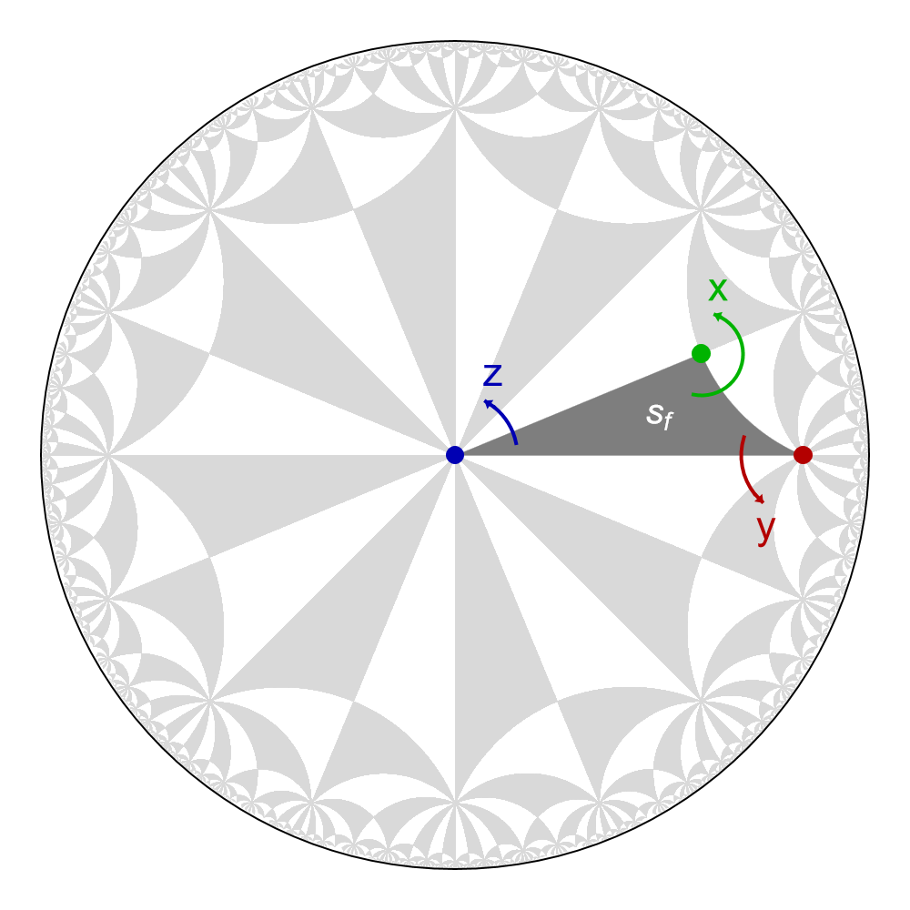

<style type="text/css">
    @media (min-width: 959.98px) {
        .bd-main .bd-content {
            max-width: 80%!important; 
            text-align:left!important;
        }
    }
</style>

# HyperCells


```{dropdown} Learning goals
:color: success
:icon: light-bulb

Construction of:

* the **proper triangle group** {math}`\Delta^{+}`,
* the graph representing a **primitive cell** and a **supercell**,
* the correpsonding graph representations of a **nearest-neighbor tight-binding model**.

Through:

* the access of **quotient groups** {math}`\Delta^{+}/\Gamma`,
* the construction of the corresponding **translation group** {math}`\Gamma`.
```

```{dropdown}  Featured functions
:color: info
:icon: gear

<code class="code-gap" style="font-size:1.1em;">
ProperTriangleGroup, FpGroup, ListTGQuotients, TGQuotient, TGQuotientGroup, TGTranslationGroup, TGCellGraph, TessellationModelGraph, TGCellSymmetric, TGSuperCellModelGraph, 
</code>
```

To use the HyperCells package, start GAP and then load the package with
```gap
gap> LoadPackage("HyperCells");
```

A typical workflow starts by setting up the (proper) triangle group, here we choose {math}`\Delta^{+}(2,8,8)`

```gap
gap> tg := ProperTriangleGroup( [ 2, 8, 8 ] );
ProperTriangleGroup(2, 8, 8)
```

The returned object is of category <code class="code-gap" style="font-size:1.1em;">ProperTriangleGroup</code> (<a target="_blank" href="https://patrick-lenggenhager.github.io/HyperCells/doc/chap2_mj.html">see 2.1</a>). The presentation of the proper triangle group can be extracted by applying the operation <code class="code-gap" style="font-size:1.1em;">FpGroup</code>:

```gap
gap> FpGroup(tg);
<fp group on the generators [ x, y, z ]>
```

This is a free group with rotation generators <code class="code-gap" style="font-size:1.1em;">x</code>,
<code class="code-gap" style="font-size:1.1em;">y</code> and <code class="code-gap" style="font-size:1.1em;">z</code>. The **HyperBloch** package in Mathematica enables us to visualize how the fundamental Schwarz triangle <code class="code-gap" style="font-size:1.1em;">s<sub>f</sub></code> is transported in a {math}`\{p,q\}`-tesselations of the hyperbolic plane when acting upon it with the rotation generators (such visualization will be discussed in the tutorial [Advanced visualization](../Tutorials/AdvancedVisualization.md)):

<figure class="text-center">
  <picture> 
    <source type="image/svg+xml" srcset="../../../source/assets/media/figs/getSetGoHyperCells/Sym88.png">
    
  </picture>
</figure>

Next, we specify a unit cell 
of the lattice in terms of the quotient of the proper triangle group {math}`\Delta^{+}` with a translation group {math}`\Gamma \triangleleft \Delta^{+}`. For that we can query
 the included database based on the work of <a target="_blank" href="https://patrick-lenggenhager.github.io/HyperCells/doc/chapBib_mj.html#biBConder:2007">Marston Conder</a>:

```gap
gap> ListTGQuotients( [ 2, 8, 8 ] );
[ [ 2, 6 ], [ 3, 10 ], [ 3, 11 ], [ 5, 12 ], [ 5, 13 ], [ 9, 19 ], ... ]
```

which allows us to select one of them. In the following, we select the quotient denoted by <code class="code" style="font-size:1.1em;">T2.6</code>, where the '2' indicates the genus of the surface on which the quotient group acts, and the '6' indicates the position in the list of all quotients with the same genus.

```gap
gap> q := TGQuotient( [ 2, 6 ] );
TGQuotient([ 2, 6 ], [ 2, 8, 8 ], 8, 2, Action reflexible [m,n],[ x^2, x * y * z, x * z * y, y^3 * z^-1 ])
```

as an object of category <code class="code-gap" style="font-size:1.1em;">TGQuotient</code> (<a target="_blank" href="https://patrick-lenggenhager.github.io/HyperCells/doc/chap2_mj.html#X84E92102876317DE">see 2.3</a>). Alternatively, we can access the first entry appearing for {math}`\Delta^{+}(2,8,8)` using:

```gap
gap> q := TGQuotient( 1, [ 2, 8, 8 ] );
TGQuotient([ 2, 6 ], [ 2, 8, 8 ], 8, 2, Action reflexible [m,n],[ x^2, x * y * z, x * z * y, y^3 * z^-1 ])
```

Once we have the triangle group and the <code class="code-gap" style="font-size:1.1em;">TGQuotient</code> object, we can obtain the quotient group {math}`G^{+}\cong \Delta^{+}/\Gamma`:


```gap
gap> G := TGQuotientGroup( tg, q );
<fp group on the generators [ x, y, z ]>
```

or the associated translation group {math}`\Gamma`:

```gap
gap> TGTranslationGroup( tg, q );
TranslationGroup( < g1, g2, g3, g4 | g4*g3*g2*g1*g2^-1*g4^-1*g1^-1*g3^-1 > )
```

The next step is to construct the graph representing primitive cell. This graph corresponds to a triangular tessellation of the compactified cell and is stored as an object of category <code class="code-gap" style="font-size:1.1em;">TGCellGraph</code> (<a target="_blank" href="https://patrick-lenggenhager.github.io/HyperCells/doc/chap3_mj.html#X7945E96B7A771F5A">see 3.7</a>). In addition to the triangle group and quotient, we also need to specify the vertex at which the cell should be centered (here we choose <code class="code-gap" style="font-size:1.1em;">3</code>, corresponding to the <code class="code-gap" style="font-size:1.1em;">z</code> vertex of the fundamental Schwarz triangle):

```gap
gap> cg := TGCellGraph( tg, q, 3 : simplify := 5 );
TGCellGraph(
    TGCell( ProperTriangleGroup(2, 8, 8), [ x^2, x*y*z, x*z*y, y^3*z^-1 ] ),
    center = 3,
    vertices = [ [ 1, 1 ], [ 1, 2 ], [ 1, 3 ], [ 1, 4 ], [ 2, 1 ], [ 3, 1 ] ],
    edges = [ [ 1, 6, 1, <identity ...> ], ..., [ 6, 5, 8, g1^-1*g2*g3^-1 ] ],
    faces = [ [ [ 3, 1 ], [ 2, 1 ], [ 14, -1 ], [ 6, -1 ] ], ... ],
    boundary = [ [ <identity ...>, <identity ...>, 2, 1, 0, g1 ], ... ]
)
```

The option <code class="code-gap" style="font-size:1.1em;">simplify</code> specifies the maximum wordlength that should be checked for simplifying expressions in terms of the translation generators <code class="code-gap" style="font-size:1.1em;">g1</code>, <code class="code-gap" style="font-size:1.1em;">g2</code>, etc. The default value is <code class="code-gap" style="font-size:1.1em;">0</code> which means that no simplification is performed. While the graph itself represents the compactified cell, potential translations associated with the edges crossing from one copy of the cell to another are stored as well. See <a target="_blank" href="https://patrick-lenggenhager.github.io/HyperCells/doc/chap3_mj.html#X7945E96B7A771F5A">3.7</a> for more details the format of the vertices, edges, faces, and the boundary.

The cell graph can be exported using the <code class="code-gap" style="font-size:1.1em;">Export</code> (<a target="_blank" href="https://patrick-lenggenhager.github.io/HyperCells/doc/chap3_mj.html#X7945E96B7A771F5A">3.7-13</a>) operation, see <a target="_blank" href="https://patrick-lenggenhager.github.io/HyperCells/doc/chap7_mj.html#X7CFBF28C7E45D68A">7.1</a> for more details on the produced file format to import it using other software.

With the cell graph at hand, we can derive a model graph, such as a tessellation graph, i.e., the nearest-neighbor graph of the {math}`\{8,8\}`-tessellation of the hyperbolic plane restricted to the primitive cell:

```gap
gap> model := TessellationModelGraph( cg, true : simplify := 0 );
TGCellModelGraph(
    TGCell( ProperTriangleGroup(2, 8, 8), [ x^2, x*y*z, x*z*y, y^3*z^-1 ] ),
    center = 3,
    type = [ "TESS", [ 8, 8 ], [ "VEF", [ [ 3 ], [ 1 ], [ 2 ] ] ] ],
    vertices = [ [ 3, 1 ] ],
    edges = [ [ 1, 1, [ 1, [ 1, 1, 5 ] ], g1 ], [ 1, 1, [ 1, [ 2, 4, 8 ] ], g4 ],
        [ 1, 1, [ 1, [ 3, 2, 6 ] ], g2 ], [ 1, 1, [ 1, [ 4, 3, 7 ] ], g3 ] ],
    faces = [ [ [ 1, -1 ], [ 2, -1 ], [ 4, 1 ], [ 3, -1 ], [ 1, 1 ], [ 2, 1 ],
        [ 4, -1 ], [ 3, 1 ] ] ]
)
```

The result is an object of category <code class="code-gap" style="font-size:1.1em;">TGCellModelGraph</code> (<a target="_blank" href="https://patrick-lenggenhager.github.io/HyperCells/doc/chap4_mj.html#X87FE1AF37CFB0B86">see 4.1</a>), which can be exported using the <code class="code-gap" style="font-size:1.1em;">Export</code> (<a target="_blank" href="https://patrick-lenggenhager.github.io/HyperCells/doc/chap4_mj.html#X7C1C17EF7A0F02BA">see 4.4-1</a>) operation, producing a file in the format described in <a target="_blank" href="https://patrick-lenggenhager.github.io/HyperCells/doc/chap7_mj.html#X8672A7E782E0D7F3">7.2</a>.


Finally, the model graph defined on the primitive cell can be extended to a **supercell**, i.e., a cell specified by a translation subgroup {math}`\Gamma^{'}\triangleleft\Gamma` of the original translation group {math}`\Gamma` . Here, we consider the one given by the quotient <code class="code-gap" style="font-size:1.1em;">T3.11</code> (see tutorial [Supercells](../Tutorials/Supercells) for a in depth discussion) and first construct the **symmetric** cell, without simplifying the translation generators:

```gap
gap> sc := TGCellSymmetric( tg, TGQuotient( [ 3, 11 ] ), 3 );
TGCell( ProperTriangleGroup(2, 8, 8), [ x^2, x*y*z, x*z*y, y^-8 ] )
```
and then construct the supercell model graph:

```gap
gap> scmodel := TGSuperCellModelGraph( model, sc : simplify := 0 );
TGSuperCellModelGraph(
    primitive cell = TGCell( ProperTriangleGroup(2, 8, 8),
        [ x^2, x*y*z, x*z*y, y^3*z^-1 ] ),
    supercell = TGCell( ProperTriangleGroup(2, 8, 8),
        [ x^2, x*y*z, x*z*y, y^-8 ] ),
    cell embedding = TGCellEmbedding(
        primitive cell = TGCellTranslationGroup( < g1, g2, g3, g4 |
            g2*g1^-1*g4^-1*g3*g2^-1*g1*g4*g3^-1 > ),
        supercell = TGCellTranslationGroup( < g1, g2, g3, g4, g5, g6 |
            g6*g4*g2*g1*g3*g5*g3^-1*g2^-1*g6^-1*g5^-1*g1^-1*g4^-1 > ),
        transversal = [ <identity ...>, (x^-1*y^-1)^4*x^-1 ],
        embedding = [ g1, g2, g3, g4, g5, g6 ] -> [ g1^-1*g4^-1, ... ]
    ),
    center = 3,
    type = [ "TESS", [ 8, 8 ], [ "VEF", [ [ 3 ], [ 1 ], [ 2 ] ] ] ],
    vertices = [ [ 3, 1, 1 ], [ 3, 1, 2 ] ],
    edges = [ [ 1, 2, [ 1, 1, [ 1, [ 1, 1, 5 ] ] ], <identity ...> ], ... ],
    faces = [ ]
)
```
which is returned as an object of category <code class="code-gap" style="font-size:1.1em;">TGSuperCellModelGraph</code> (see <a target="_blank" href="https://patrick-lenggenhager.github.io/HyperCells/doc/chap5_mj.html#X84E3E01A7C2274DF">5.1</a>) and can be exported using the <code class="code-gap" style="font-size:1.1em;">Export</code> (<a target="_blank" href="https://patrick-lenggenhager.github.io/HyperCells/doc/chap5_mj.html#X802566E77A19B02E">5.5-1</a>) operation, producing a file in the format described in <a target="_blank" href="https://patrick-lenggenhager.github.io/HyperCells/doc/chap7_mj.html#X79442B71791A7C60">7.3</a>.


