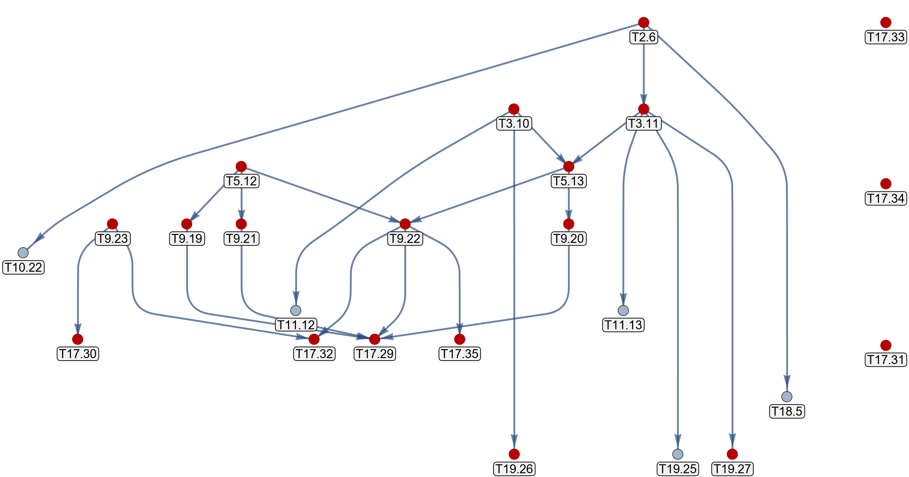

# Coherent sequences

```{dropdown} Learning goals
:color: success
:icon: light-bulb

Identifying supercell sequences through:
* custom functions
* and normal subgroup tree graphs.
```

```{dropdown}  Featured functions
:color: info
:icon: gear

**HyperCells:**

<code class="code-gap" style="font-size:1.1em;">
ProperTriangleGroup, TGQuotient, TGTranslationGroup, TGCellGraph, TessellationModelGraph, Export, AsTGSubgroup, FpGroup, Signature, TriangleGroup, TGQuotientRelators, TGQuotientName, TGCellSymmetric, TGSuperCellModelGraph, TGQuotientSequencesAdjacencyMatrix, GetLongestSequence
</code>
<br></br>

**HyperBloch:**

<code class="code-gap" style="font-size:1.1em;">
ImportAdjMatrixString
</code>
```

The application of the supercell method relies on the construction of appropriate supercell sequences, so-called **cohrent sequences**. In the previous tutorial [Supercells](./Supercells.md) we have seen how such sequences are constructed, but have kept their identification somewhat shrouded. As such, let us see how suitable supercell sequences can be determined.

In this tutorial we will look at two approaches to construct supercell sequences which consist of constructing a custom function and a **normal subgroup tree graph**. A usual workflow starts by constructing the latter, which shows the normal subgroup relations between any given translation group extracted from quotient groups in  <a target="_blank" href="https://patrick-lenggenhager.github.io/HyperCells/doc/chapBib_mj.html#biBConder:2007">Marston Conder's</a> list. 

As usual, we start by constructing the proper triangle group, the quotient group for the primitive cell and additionally the corresponding translation group for the {math}`\{8,8\}`-lattice in **GAP**:

```gap
# load the HyperCells package
LoadPackage( "HyperCells" );

# set up (proper) triangle group
tg := ProperTriangleGroup( [ 2, 8, 8 ] );

# specify the quotient defining the primitive cell
qpc := TGQuotient( 1, [ 2, 8, 8 ] );

# associated translation group
tgGamma_pc1 := TGTranslationGroup( tg, qpc );

# construct symmetric primitive cell
cgpc := TGCellGraph( tg, qpc, 3 : simplify := 5 );

# elementary nearest-neighbor model
model := TessellationModelGraph( cgpc, true : simplify := 5 );
Export( model, "{8,8}-tess_T2.6_3.hcm" ); # export
```

```{admonition} Skip to section [Normal subgroup tree graph approach](normal-subgroup-tree-graph-approach)
:class: seealso-icon

On a first read, one may want to skip the section "Custom function approach" and resume at the section "Normal subgroup tree graph approach".
```

## Custom function approach

Before constructing our custom function, let us go through the main points that should be considered in any custom function that identifies coherent supercell sequences.

The {math}`(m+1)`-supercell in a coherent supercell sequence is associated with a translation group {math}`\Gamma^{(m+1)}`, which is a consecutive normal subgroup of the translation group {math}`\Gamma^{(m)}` (of the m-supercell) and the proper triangle group {math}`\Delta^{+}`. We extract the translation groups {math}`\Gamma^{(m)}` from quotient groups in <a target="_blank" href="https://patrick-lenggenhager.github.io/HyperCells/doc/chapBib_mj.html#biBConder:2007">Marston Conder's</a> list. Since they are normal subgroups of {math}`\Delta^{+}`, it is sufficient to check if the set of elements in a translation group {math}`\Gamma^{(m+1)}` forms a subset of the domain of {math}`\Gamma^{(m)}`. 

For example, let us extract the translation group associated with the second quotient group in order to identify the first candidate for the 2-supercell:

```gap
q2 := TGQuotient(2, [2, 8, 8]);
tgGamma_2 := TGTranslationGroup(tg, q2);
```

This translation group, however, is not a normal subgroup of the previous translation group:

```gap
gap> IsSubset(AsTGSubgroup(tgGamma_pc1), AsTGSubgroup(tgGamma_2));
false
```

but the next one is:

```gap
q3 := TGQuotient(3, [2, 8, 8]);
tgGamma_3 := TGTranslationGroup(tg, q3);
```

and:

```gap
gap> IsSubset(AsTGSubgroup(tgGamma_pc1), AsTGSubgroup(tgGamma_3));
true
```

Next, we impose that supercells are symmetric aggregates of primitive cells. Thus, restricting the selection of quotient groups to those with **point groups** {math}`G^{(m)}` and **proper point groups** {math}`G^{+ (m)}` with order {math}`|G^{(m)}| = 2|G^{+ (m)}|`.

The extracted quotient groups are isomorphic to the proper point groups {math}`G^{+ (m)}`. For example, the thrid quotient group, isomorphic to the proper point group {math}`G^{+ (2)}`, is:

```gap
Gplus := TGQuotientGroup(tg, q3);
```

The point groups {math}`G^{(m)}` can be constructed through the (full) triangle group {math}`\Delta` by using the embedding of the proper triangle group {math}`\Delta^{+}` in the (full) triangle group {math}`\Delta`:

```gap
# presentation of the (full) triangle group
DELTA := FpGroup(TriangleGroup(Signature(tg)));
a := DELTA.1;; b := DELTA.2;; c := DELTA.3;

# embedding homomorphism of D in DELTA
embDDELTA := GroupHomomorphismByImagesNC(D, DELTA, GeneratorsOfGroup(D), [a*b, b*c, c*a]);
```

We can use this homomorphism in order to find the relators of {math}`G^{+ (m)}` in terms of generators of {math}`\Delta`, and thus enabling us to constrcut {math}`G^{(m)}`. For example, for the third quotient we find {math}`G^{(2)}`:

```gap
# relators of the proper point group
rels := TGQuotientRelators(tg, q3);

# point group
relsfull := List(rels, r -> Image(embDDELTA, r));
G := DELTA / relsfull;
```

We can check if our constraint is fulfiled:

```gap
gap> Order(G) = 2 * Order(Gplus);
true
```

As such, a possible function to retrive a particular supercell sequence is given:

```gap
getMthSupercellQuotient := function(tg, tgGamma, n1)
        local tgGamma_n, Gamma1, qn, signat, switch, 
        i, D, rels, G, Gplus, a, b, c, DELTA, 
        embDDELTA, relsfull;

  # signature (2, q, p)
  signat := Signature(tg);

  # presentation of the proper triangle group  
  D := FpGroup(tg);

  # translation group in terms of generators x, y, z
  Gamma1 := AsTGSubgroup(tgGamma);
	
  # presentation of the (full) triangle group
  DELTA := FpGroup(TriangleGroup(Signature(tg)));
  a := DELTA.1;; b := DELTA.2;; c := DELTA.3;

  # embedding homomorphism of D in DELTA
  embDDELTA := GroupHomomorphismByImagesNC(D, DELTA,
      GeneratorsOfGroup(D), [a*b, b*c, c*a]);

  i := n1;
  switch := false;
  while switch = false do
                
    qn := TGQuotient(i, signat);
    tgGamma_n := TGTranslationGroup(tg, qn);
    switch := IsSubset(Gamma1, AsTGSubgroup(tgGamma_n));
    if switch then
    
      # proper point group
      Gplus := D / rels;

      # relators of the proper point group
      rels := TGQuotientRelators(tg, qn);
      
      # (full) point group
      relsfull := List(rels, r -> Image(embDDELTA, r));
      G := DELTA / relsfull;
      
      # ensure that quotient is mirror symmetric
      if not Order(G) = 2 * Order(Gplus) then
        switch := false;
      fi; 
     fi;
  
   i := i + 1;
  od;

 return [qn, tgGamma_n, i];
end;;
```

This function takes as arguments a <code class="code-gap" style="font-size:1.1em;">ProperTriangleGroup</code> (<a target="_blank" href="https://patrick-lenggenhager.github.io/HyperCells/doc/chap2_mj.html#X84E92102876317DE">see 2.3</a>) and a <code class="code-gap" style="font-size:1.1em;">TGTranslationGroup</code> (see 2.2 (href ???)). The integer <code class="code-gap" style="font-size:1.1em;">n1</code> is the first index of the quotient groups in the list <code class="code-gap" style="font-size:1.1em;">ListTGQuotients( [ 2, 8, 8 ] )</code> that will be checked to satisfy the conditions stated above. Let us apply this function in order to retrive a first supercell:

```gap
qANDtgGamma_sc1 := getMthSupercellQuotient(tg, tgGamma_pc1, 2);
```

The first supercell in this sequence is given by:

```gap
gap> qsc_3_11 := qANDtgGamma_sc1[1];;
gap> TGQuotientName(qsc_3_11);
[ 3, 11 ]
```

The <code class="code-gap" style="font-size:1.1em;">TGQuotientName</code> returns the label given in M. Conder's list, where <code class="code-gap" style="font-size:1.1em;">3</code> is the genus of the Rieman surface the quotient acts upon and <code class="code-gap" style="font-size:1.1em;">11</code> the index in the list. Let us retrive the next 5 supercells, together with the corresponding  tessellation graphs, i.e., the nearest-neighbor graphs of the {math}`\{8,8\}`-tessellation of the hyperbolic plane by iterating over the list of avilable quotient:


```gap
n0 := 2;
tgGamma_sc_i := tgGamma_pc1;

for i in [1 .. 6] do

  # find appropriate quotient group
  qANDtgGamma_sc_i := getMthSupercellQuotient(tg, tgGamma_sc_i, n0);
  qsc_i := qANDtgGamma_sc_i[1];;
  tgGamma_sc_i := qANDtgGamma_sc_i[2];; 
  n0 := qANDtgGamma_sc_i[3];;

  # construct tessellation graphs
  sc_i := TGCellSymmetric(tg, qsc_i, 3);
  scmodel_i := TGSuperCellModelGraph(model, sc_i);

  # export file
  sc_i_index := TGQuotientName(qsc_i);
  sc_i_label := StringFormatted("-tess_T2.6_3_sc-T{}.{}.hcs", sc_i_index[1], sc_i_index[2]);
  scmodel_i_name := JoinStringsWithSeparator(["{8,8}", sc_i_label], "");
  Export(scmodel_i,  scmodel_i_name);

od;
```

The sequence of quotient groups is <code class="code-gap" style="font-size:1.1em;">T2.6</code>, <code class="code-gap" style="font-size:1.1em;">T3.11</code>, <code class="code-gap" style="font-size:1.1em;">T5.13</code>, <code class="code-gap" style="font-size:1.1em;">T9.20</code>, <code class="code-gap" style="font-size:1.1em;">T17.29</code>, <code class="code-gap" style="font-size:1.1em;">T33.44</code> and <code class="code-gap" style="font-size:1.1em;">T65.78</code>.

<div class="flex ">
  <a href="../../../source/assets/misc/code_snippets/Tutorials/Supercells/tutorial_Supercells_HyperCells_pc_sc_files.zip" class="btn btn-primary" class="flex-child"><i class="fa-solid fa-download"></i> Download generated files</a>
  <a href="../../../source/assets/misc/code_snippets/Tutorials/Supercells/tutorial_Supercells_HyperCells.g" class="btn btn-primary" class="flex-child"><i class="fa-solid fa-download"></i> Download GAP Code</a>
</div>

## Normal subgroup tree graph approach

Identifying sequences of supercells through custom functions might be cumbersome. The built-in function to identify normal subgroup relations of the translation groups provides efficient access to all sequences which are normal subgroups of {math}`\Delta^{+}` and obey the normal subgroup relation {math}`\Delta^{+}\triangleright \Gamma^{(1)} \triangleright \Gamma^{(2)} \triangleright \cdot \cdot \cdot \triangleright \Gamma^{(m)} \triangleright  \cdot \cdot \cdot` avialable through the access of <a target="_blank" href="https://patrick-lenggenhager.github.io/HyperCells/doc/chapBib_mj.html#biBConder:2007">Marston Conder</a> list. It can be used to build advanced custom functions as well as to visualize appropriate sequences in tree graphs we denote as normal subgroup tree graphs. 

In order to visualize a normal subgroup tree graph we first need to construct an adjacency matrix, which describes the normal subgroup relations between any pairwise disctinct translation group of a {math}`\{p,q\}`-tessellation of the hyperbolic plane. Since these matrices are in general sparsly occupied we may choose a sparse representation. The adjacency matrix for the {math}`\{8,8\}`-tesselation, with quotient groups acting upon Rieman surfaces up to genus <code class="code-gap" style="font-size:1.1em;">20</code>, can be extracted as follows:

```gap
tgQAdjMat := TGQuotientSequencesAdjacencyMatrix(tg : sparse := true, boundByGenus := 20);;
```

The returned object is of category <code class="code-gap" style="font-size:1.1em;">TGQuotientSequencesAdjacencyMatrix</code> (see href?). This enables us to extract one of the longest coherent supercell sequence avialable, with supercells that can be symmetrically aggregated with primitive cells (see href ??):

```gap
gap> GetLongestSequence(tgQAdjMat);
[ [ 2, 6 ], [ 3, 11 ], [ 5, 13 ], [ 9, 20 ], [ 17, 29 ] ]
```
We can also specify the starting quotient of the sequence:

```gap
gap> GetLongestSequence(tgQAdjMat : quotient := [ 9, 23 ]);
[ [ 9, 23 ], [ 17, 30 ] ]
```

Next, let us export the adjacency matrix in order to visualize the normal subgroup tree graph in Mathematica, which can be done by using the Export (href ??) operation (see href ?? for more details on the produced file format to import it using other software):

```gap
Export(tgQAdjMat, "(2,8,8)-AdjMat_bg20.hcqs");
```

<div style="text-align: right;">
  <a href="../../../source/assets/misc/code_snippets/Tutorials/Supercells/tutorial_Supercells_HyperCells_SubgroupAdjMat88.g" class="btn btn-primary"><i class="fa-solid fa-download"></i> Download generated file</a>
</div>
<br>

We import the adjacency matrix in **Mathematica** using the function <code class="code-Mathematica" style="font-size:1.1em;">ImportAdjMatrixString[]</code>:

```Mathematica
(* Preliminaries *)
<< PatrickMLenggenhager`HyperBloch`
SetDirectory[NotebookDirectory[]];

(* Import adjacency matrix *)
adjM88 = ImportAdjMatrixString[Import["(2,8,8)-AdjMat_bg20.hcqs"]]; 
```

It is convenient to discard any normal subgroup relation beyond immediate consecutive translation groups:

```Mathematica
(* Calculate nearest-neighbor relations *)
NNadjM88 = adjM88["AdjacencyMatrix"] - Sign@MatrixPower[adjM88["AdjacencyMatrix"], 2];
```

The normal subgroup tree graph can be visualized as follows:

```Mathematica
AdjacencyGraph[NNadjM88, 
  GraphLayout -> {
    "LayeredDigraphEmbedding", "VertexLayerPosition" -> adjM88["vertexLayerPosition"]
  }, 
  VertexLabels -> adjM88["VertexLabels"], GraphHighlight -> adjM88["HighlightSm"],
  VertexSize -> 0.35, EdgeStyle -> AbsoluteThickness[3], AspectRatio -> 0.5, ImageSize -> Scaled[1]]
```

<figure class="text-center">
  <picture> 
    <source type="image/svg+xml" srcset="../../../source/assets/media/figs/Tutorials/Supercells/SubgroupTreegraph.png">
    
  </picture>
</figure>

Every vertex corresponds to a normal subgroup {math}`\Gamma^{(m)}`. They are labeled by a corresponding quotient group {math}`\Delta^{+}/\Gamma^{(m)}`, denoted as <code class="code-gap" style="font-size:1.1em;">Tg.n</code>, where <code class="code-gap" style="font-size:1.1em;">g</code> is the genus of the corresponding closed Riemann surface up to genus 20 and <code class="code-gap" style="font-size:1.1em;">n</code> is the <code class="code-gap" style="font-size:1.1em;">n</code>'th quotient group with that genus. Vertices highlighted in red indicate that Schwarz triangles can be assembled mirror symmetrically, given an appropriate choice of representatives in the right transversal. Blue vertices do not admit a mirror-symmetric unit cell, and they cannot be analyzed with the present version of the HyperCells package. Pairwise distinct vertices {math}`\Gamma^{(m)},\,\Gamma^{(m+1)}` connected by a directed edge obey the normal subgroup relation {math}`\Gamma^{(m)} \triangleright \Gamma^{(m+1)}`. 

Two suitable supercell sequences are, for example:

<p style="text-align: center;">
<code class="code-gap" style="font-size:1.1em;">T3.10</code>, <code class="code-gap" style="font-size:1.1em;">T5.13</code>, <code class="code-gap" style="font-size:1.1em;">T9.22</code> and <code class="code-gap" style="font-size:1.1em;">T17.35</code> 
</p>

and

<p style="text-align: center;">
<code class="code-gap" style="font-size:1.1em;">T5.12</code>, <code class="code-gap" style="font-size:1.1em;">T9.22</code> and <code class="code-gap" style="font-size:1.1em;">T17.32</code> 
</p>

which were considered in the last tutorial [Supercells](./Supercells.md).