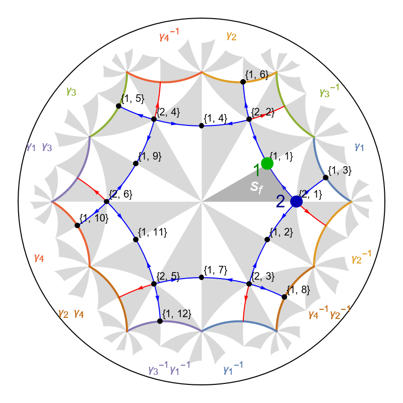
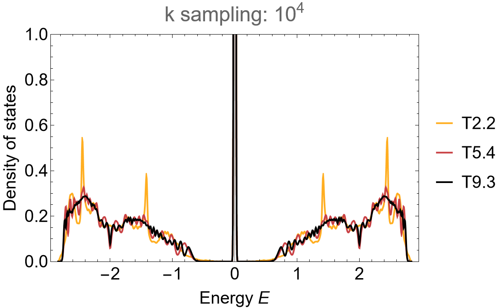
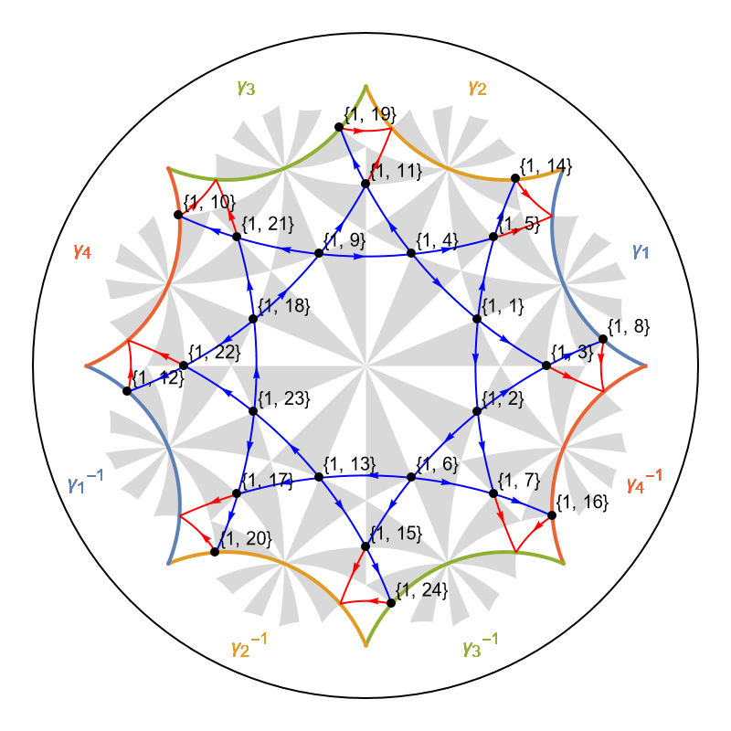
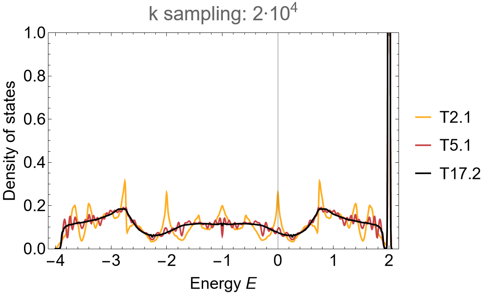

# Flat-bands

```{dropdown} Learning goals
:color: success
:icon: light-bulb

Construction of:

* hyperbolic Lieb lattices,
* hyperbolic kagome lattices and
* custom model graphs.
```

```{dropdown}  Featured functions
:color: info
:icon: gear

**HyperCells:**

<code class="code-gap" style="font-size:1.1em;">
ProperTriangleGroup, TGQuotient, TGCellGraph, Export, LiebModelGraph, TGQuotientSequencesAdjacencyMatrix, GetLongestSequence, TGCellSymmetric, TGSuperCellModelGraph, KagomeModelGraph, TGCellModelGraph
</code>
<br></br>

**HyperBloch:**

<code class="code-gap" style="font-size:1.1em;">
ImportCellGraphString, ImportModelGraphString, VisualizeModelGraph, ShowCellGraphFlattened, ShowCellBoundary, ImportSupercellModelGraphString, AbelianBlochHamiltonian
</code>
```

The HyperCells package contains built-in functions for several tight-binding models such as:

* <code class="code-gap" style="font-size:1.1em;">TessellationModelGraph</code> which constructs a tessellation graph from a cell graph of a triangle group, i.e. the nearest-neighbor graphs of the {math}`\{p,q\}`-tessellation of the hyperbolic plane.

* <code class="code-gap" style="font-size:1.1em;">LiebModelGraph</code> which constructs a Lieb graph from a cell graph of a triangle group.

* <code class="code-gap" style="font-size:1.1em;">KagomeModelGraph</code> which constructs a kagome graph from a cell graph of a triangle group.

* <code class="code-gap" style="font-size:1.1em;">TGCellModelGraph</code> which constructs a model graph from a cell graph and a specification of which cell-graph vertices are to be used as vertices of the model graph, which define edges, and
which define faces of the model graph.

as well as :

* <code class="code-gap" style="font-size:1.1em;">AddOrientedNNNEdgesToTessellationModelGraph</code> which modifies the {math}`\{p,q\}`-tessellation model graph model by adding oriented next-nearest neighbor edges to all faces with at least five edges.

Previously, in the tutorials [Getting started with HyperBloch](../GettingStarted/getSetGo_HyperBloch.md) and [Supercells](./Supercells.md), we have constructed tessellation graphs. In this tutorial we will constrcut hyperbolic Lieb lattices and hyperbolic kagome lattices on primitive cells and supercells. Both constructions rely on the <code class="code-gap" style="font-size:1.1em;">TGCellModelGraph</code> function which we will discuss afterwards.

```{admonition} Skip to page [Haldane model](./Haldane_model.md)
:class: seealso-icon

The construction of next-nearest-neighbor model graphs through the function <code class="code-gap" style="font-size:1.1em;">AddOrientedNNNEdgesToTessellationModelGraph</code> will be discussed in the next tutorial on hyperbolic Haldane models.
```

## {math}`\{6,4\}` Lieb lattice

Hyperbolic Lieb lattices are specified by placing vertices at Wyckoff positions <code class="code-gap" style="font-size:1.1em;">1</code> and <code class="code-gap" style="font-size:1.1em;">2</code> for {math}`\{p,q\}`-tesselations of the hyperbolic plane (here we choose <code class="code-gap" style="font-size:1.1em;">1</code> and <code class="code-gap" style="font-size:1.1em;">2</code> corresponding to the <code class="code-gap" style="font-size:1.1em;">x</code> and <code class="code-gap" style="font-size:1.1em;">y</code> vertices of the fundamental Schwarz triangle). As ususal, we start by constructing the cell graph and model graph for the primitive cell in **GAP**:

```gap
# Primitive cell:
# ---------------
tg := ProperTriangleGroup( [ 2, 4, 6 ] );
qpc := TGQuotient( 1, [ 2, 4, 6 ] );
cgpc := TGCellGraph( tg, qpc, 3 : simplify := 5 );
Export( cgpc, "(2,4,6)_T2.2_3.hcc" ); # export
```

Analogous to the <code class="code-gap" style="font-size:1.1em;">TessellationModelGraph</code> function, all built-in model graph functions only need to be specified on the **primitive cell**. The model specifications are inherited by subsequent supercell model graphs. The Lieb lattice can be constructed as follows:

```gap
# Lieb lattice:
# -------------
# elementary nearest-neighbor model
model_Lieb := LiebModelGraph( cgpc );
Export( model_Lieb, "{6,4}-Lieb_T2.2_3.hcm" ); # export
```

We choose a supercell sequence by following the central concepts discussed in the tutorial [Supercells](./Supercells.md) and [Coherent sequences](./Coherent_SC_sequences.md):

```gap
# Supercells:
# -----------
tgQAdjMat := TGQuotientSequencesAdjacencyMatrix(tg : boundByGenus := 10);;
sequence := GetLongestSequence(tgQAdjMat : quotient := 1);
sc_lst := sequence{[2..Length(sequence)]};

for sc_i_index in sc_lst do

  qsc_i := TGQuotient( sc_i_index );
  sc_i := TGCellSymmetric(tg, qsc_i, 3);
  scmodel_i := TGSuperCellModelGraph(model_Lieb, sc_i);
  
  sc_i_label := StringFormatted("_T2.2_3_sc-T{}.{}.hcs", sc_i_index[1], sc_i_index[2]);
  scmodel_i_name := JoinStringsWithSeparator(["{6,4}-Lieb", sc_i_label], "");
  Export(scmodel_i,  scmodel_i_name); # export
od;
```

<div class="flex ">
  <a href="../../../source/assets/misc/code_snippets/Tutorials/FlatBands/tutorial_FlatBands_{6,4}-Lieb_HyperCells_pc_sc_files.zip" class="btn btn-primary" class="flex-child"><i class="fa-solid fa-download"></i> Download generated files</a>
  <a href="../../../source/assets/misc/code_snippets/Tutorials/FlatBands/tutorial_FlatBands_{6,4}-Lieb_HyperCells.g" class="btn btn-primary" class="flex-child"><i class="fa-solid fa-download"></i> Download GAP Code</a>
</div>
<br></br>

Next, in **Mathematica** we import the generated files for the primitive cell and visualize the model graph:

```Mathematica
(* Preliminaries *)
cellsLieb = {"T2.2", "T5.4", "T9.3"}; 
genusLstLieb = {2, 5, 9};

(* Primitive cell *)
pcellLieb = ImportCellGraphString[Import["(2,4,6)_T2.2_3.hcc"]];
pcmodelLieb = ImportModelGraphString[Import["{6,4}-Lieb_T2.2_3.hcm"]];

VisualizeModelGraph[pcmodelLieb,
  Elements -> <|
        ShowCellGraphFlattened -> {},
   	ShowCellBoundary -> {ShowEdgeIdentification -> True}
  |>,
  CellGraph -> pcellLieb,
  NumberOfGenerations -> 3,
  ImageSize -> 400]
```

<figure class="text-center">
  <picture> 
    <source type="image/svg+xml" srcset="../../../source/assets/media/figs/Tutorials/FlatBands/LiebLattice{6,4}_T2.2.png">
    
  </picture>
</figure>

The supercell method can be applied as usual, where we use the function <code class="code-gap" style="font-size:1.1em;">ComputeEigenvalues</code> defined in the tutorial [Supercells](./Supercells.md):

```Mathematica
(* Import supercells *)
scmodelsLieb = Association[# ->
      ImportSupercellModelGraphString[ 
       Import[ToString@StringForm["{6,4}-Lieb_T2.2_3_sc-``.hcs", #]]]
     & /@ cellsLieb[[2 ;;]]];

(* Abelian Bloch Hamiltonians *)
HpcLieb = AbelianBlochHamiltonian[pcmodelLieb, 1, 0 &, -1 &, CompileFunction -> True];
HclstLieb =
  Join[Association["T2.2" -> HpcLieb],
   Association[# ->
       AbelianBlochHamiltonian[scmodelsLieb[#], 1, 0 &, -1 &, 
        PCModel -> pcmodelLieb, CompileFunction -> True]
      & /@ cellsLieb[[2 ;;]]]];

(* Compute the Eigenvalues *)
evalsLieb = 
  Association[
   cellsLieb[[#]] -> 
      ComputeEigenvalues[HclstLieb[cellsLieb[[#]]],  10^4, 32, genusLstLieb[[#]]] 
      & /@ Range[3]];

(* Visualize *)
SmoothHistogram[evalsLieb, 0.01, "PDF", Frame -> True, FrameStyle -> Black, 
               FrameLabel -> {"Energy E", "Density of states"}, 
               PlotRange -> {0, 1}, ImageSize -> 500, LabelStyle -> 20, 
               PlotLabel -> "k sampling: 10^4", PlotStyle -> 
               (ColorData["SunsetColors", "ColorFunction"] /@ (1 - Range[1, 3]/3.)), 
               ImagePadding -> {{Automatic, 10}, {Automatic, 10}}]

```

<figure class="text-center">
  <picture> 
    <source type="image/svg+xml" srcset="../../../source/assets/media/figs/Tutorials/FlatBands/dos_Lieb_64_scm.png">
    
  </picture>
</figure>

<div style="text-align: right;">
  <a href="../../../source/assets/misc/code_snippets/Tutorials/FlatBands/tutorial_FlatBands_{6,4}-Lieb_HyperBloch.nb" class="btn btn-primary"><i class="fa-solid fa-download"></i> Download Mathematica Notebook</a>
</div>

## {math}`\{8,3\}` kagome lattice

Hyperbolic kagome lattices can be constructed just as easily as hyperbolic Lieb lattices. These lattices are specified by placing vertices at Wyckoff positions <code class="code-gap" style="font-size:1.1em;">1</code>. These lattices are **restricted to {math}`\{p,3\}`-tessellation** of the hyperbolic plane. Once again, we start by constructing the cell graph and model graph for the primitive cell in **GAP**:

```gap
# Primitive cell:
# ---------------
tg := ProperTriangleGroup( [ 2, 3, 8 ] );
qpc := TGQuotient( 1, [ 2, 3, 8 ] );
cgpc := TGCellGraph( tg, qpc, 3 : simplify := 5 );
Export( cgpc, "(2,3,8)_T2.1_3.hcc" ); # export
```

The kagome lattice can be constructed as follows:

```gap
# Kagome lattice:
# ---------------
model_kagome := KagomeModelGraph( cgpc );
Export( model_kagome, "{8,3}-kagome_T2.1_3.hcm" ); # export
```

with supercells:

```gap
# Supercells:
# -----------
tgQAdjMat := TGQuotientSequencesAdjacencyMatrix(tg : boundByGenus := 20);;
sequence := GetLongestSequence(tgQAdjMat : quotient := 1);
sc_lst := sequence{[2..Length(sequence)]};

for sc_i_index in sc_lst do

  qsc_i := TGQuotient( sc_i_index );
  sc_i := TGCellSymmetric(tg, qsc_i, 3);
  scmodel_i := TGSuperCellModelGraph(model_kagome, sc_i);

  sc_i_label := StringFormatted("_T2.1_3_sc-T{}.{}.hcs", sc_i_index[1], sc_i_index[2]);
  scmodel_i_name := JoinStringsWithSeparator(["{8,3}-kagome", sc_i_label], "");
  Export(scmodel_i,  scmodel_i_name); # export
od;
```

<div class="flex ">
  <a href="../../../source/assets/misc/code_snippets/Tutorials/FlatBands/tutorial_FlatBands_{8,3}-kagome_HyperCells_pc_sc_files.zip" class="btn btn-primary" class="flex-child"><i class="fa-solid fa-download"></i> Download generated files</a>
  <a href="../../../source/assets/misc/code_snippets/Tutorials/FlatBands/tutorial_FlatBands_{8,3}-kagome_HyperCells.g" class="btn btn-primary" class="flex-child"><i class="fa-solid fa-download"></i> Download GAP Code</a>
</div>
<br></br>

We can proceed anologously to the hyperbolic Lieb lattice in **Mathematica**, we omitt the detailed specificities which can be found in the downloadable files. As such, let us visualize the {math}`\{8,3\}` kagome lattice: 

```Mathematica
VisualizeModelGraph[pcmodelKagome,
  Elements -> <|
        ShowCellGraphFlattened -> {},
   	ShowCellBoundary -> {ShowEdgeIdentification -> True}
  |>,
  CellGraph -> pcellKagome,
  NumberOfGenerations -> 3,
  ImageSize -> 400]
```

<figure class="text-center">
  <picture> 
    <source type="image/svg+xml" srcset="../../../source/assets/media/figs/Tutorials/FlatBands/KagomeLattice{8,3}_T2.1.png">
    
  </picture>
</figure>

The application of the supercell method shows a fast convergence to the thermodynamic limit in the density of states:

```Mathematica
SmoothHistogram[evalsKagome, 0.01, "PDF", Frame -> True, FrameStyle -> Black, 
               FrameLabel -> {"Energy E", "Density of states"}, 
               PlotRange -> {0, 1}, ImageSize -> 500, LabelStyle -> 20, 
               PlotLabel -> "k sampling: 2*10^4", PlotStyle -> 
               (ColorData["SunsetColors", "ColorFunction"] /@ (1 - Range[1, 3]/3.)), 
               ImagePadding -> {{Automatic, 10}, {Automatic, 10}}]

```

<figure class="text-center">
  <picture> 
    <source type="image/svg+xml" srcset="../../../source/assets/media/figs/Tutorials/FlatBands/dos_kagome_83_scm.png">
    
  </picture>
</figure>

<div style="text-align: right;">
  <a href="../../../source/assets/misc/code_snippets/Tutorials/FlatBands/tutorial_FlatBands_{8,3}-kagome_HyperBloch.nb" class="btn btn-primary"><i class="fa-solid fa-download"></i> Download Mathematica Notebook</a>
</div>


## Custom model graphs

The built-in Lieb and kagome model graph functions rely on the parent function <code class="code-gap" style="font-size:1.1em;">TGCellModelGraph</code>, which takes as input <code class="code-gap" style="font-size:1.1em;">cellgraph, vfs, efs, ffs</code>:

```gap
# Lieb model graph:
# -----------------
model := TGCellModelGraph(cellgraph, [ 1, 2 ], [  ], [ 3 ]);

# Kagome model graph:
# -------------------
model := TGCellModelGraph(cellgraph, [ 1 ], [ 2 ], [ 2, 3 ]);
```

The model graphs are constructed by selecting the vertices of types given in the list vfs as vertices of the model graph. The type is given in terms of the cell graph’s vertex type, i.e., <code class="code-gap" style="font-size:1.1em;">1</code>, <code class="code-gap" style="font-size:1.1em;">2</code> or <code class="code-gap" style="font-size:1.1em;">3</code>, corresponding to the vertices of the fundamental Schwarz triangle <code class="code-gap" style="font-size:1.1em;">x</code>, <code class="code-gap" style="font-size:1.1em;">y</code> and <code class="code-gap" style="font-size:1.1em;">z</code>, respectively. The edges of the model graph are determined by adjacency to the cell-graph vertices of the type given in the list efs and the faces are determined by the cell-graph vertices of the type given in the list ffs. (see href ??)


....

