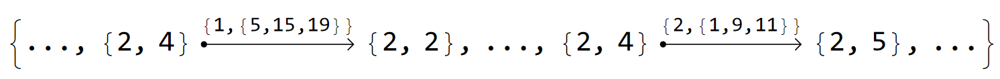
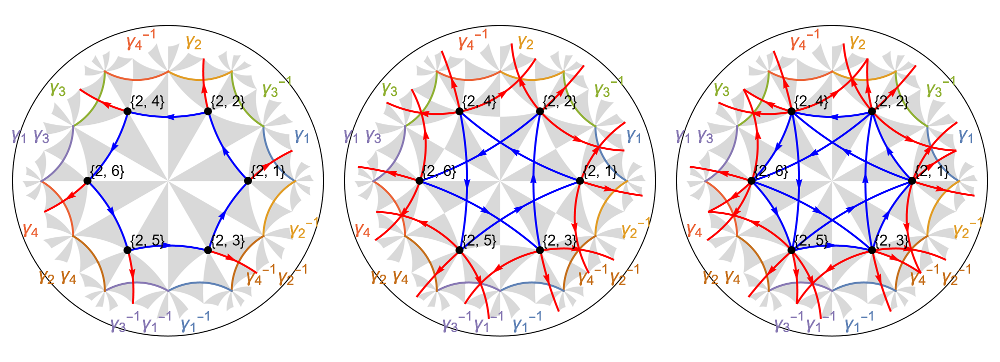
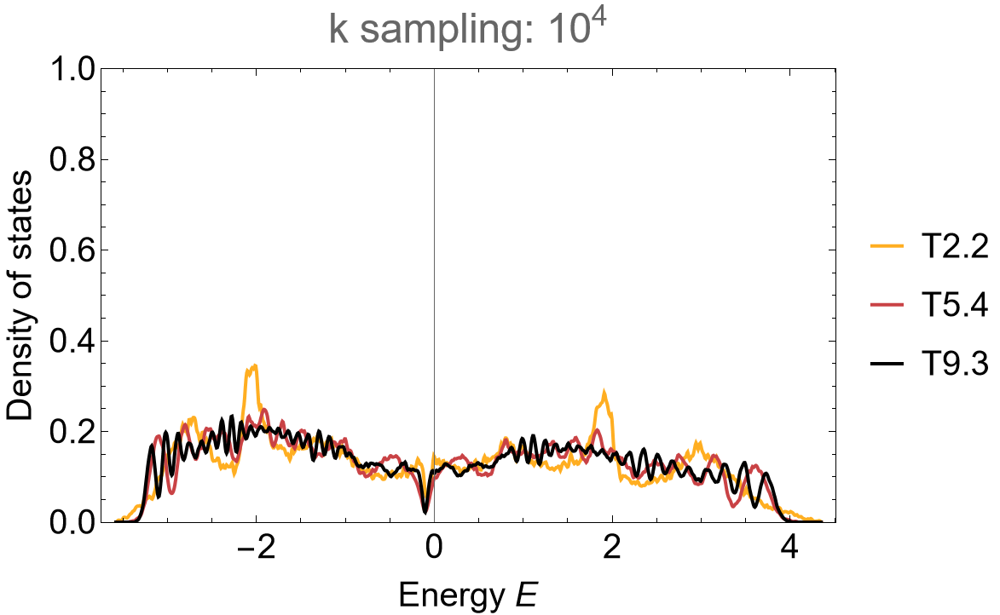
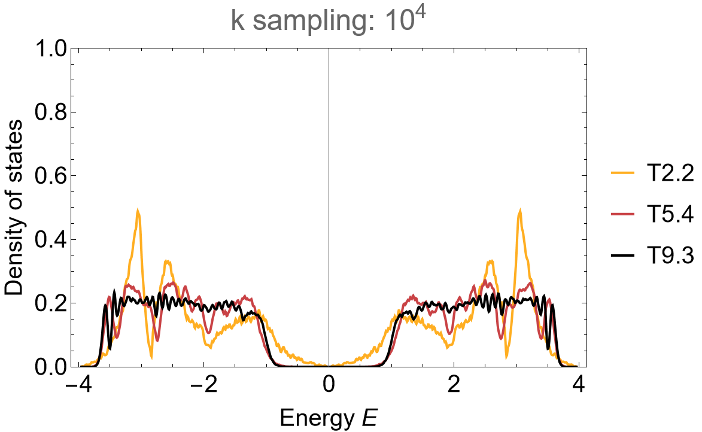
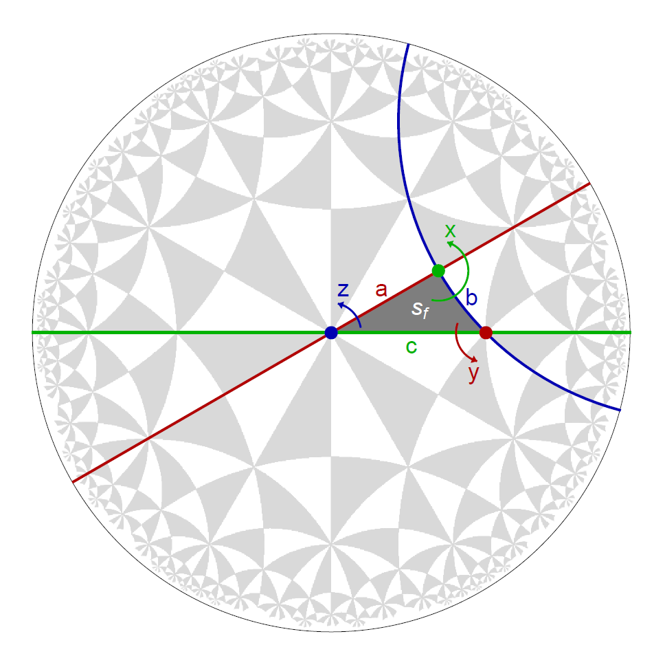
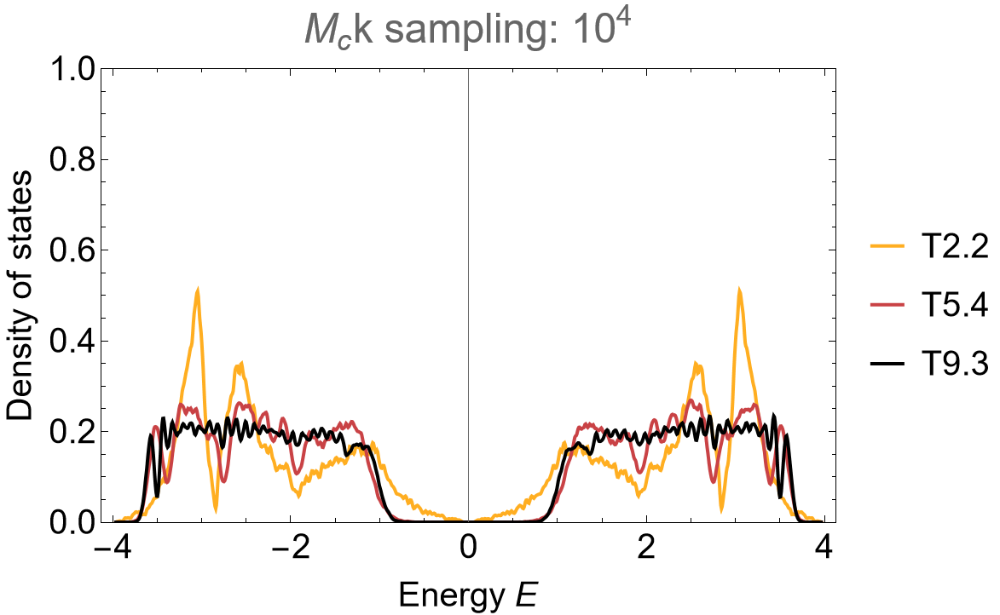

# Haldane model

```{dropdown} Learning goals
:color: success
:icon: light-bulb

Construction of:

* next-nearest-neighbor model graphs,
* Abelian Bloch Hamiltonians with orientated couplings,
* point group matrices and subgroup tree graphs as well as
* point group matrix enforced symmetry constraints.
```

```{dropdown}  Featured functions
:color: info
:icon: gear

**HyperCells:**

<code class="code-gap" style="font-size:1.1em;">
ProperTriangleGroup, TGQuotient, TGCellGraph, Export, TessellationModelGraph, AddOrientedNNNEdgesToTessellationModelGraph, TGQuotientSequencesAdjacencyMatrix, GetLongestSequence, TGCellSymmetric, TGSuperCellModelGraph, TriangleGroup, FpGroup, PGMatrix, ExportPGMatrix
</code>
<br></br>

**HyperBloch:**

<code class="code-gap" style="font-size:1.1em;">
ImportCellGraphString, ImportModelGraphString, ImportSupercellModelGraphString, VisualizeModelGraph, ShowCellGraphFlattened, ShowCellBoundary, EdgeFilter, AbelianBlochHamiltonian, ImportPGMatrixString
</code>
```

In the previous tutorials, [Supercells](./Supercells.md) and [Flat-bands](./Flat-bands.md), we have considered nearest-neighbor tight-binding models through the construction of tessellation model graphs.
The HyperCells package enables the construction of extended tessellation model graphs which are comprised not only of nearest-neighbor but also **next-nearest-neighbor terms**. In this tutorial we will see how we can extend tessellation model graphs through the construction of next-nearest-neighbor tight-binding models on the {math}`\{6,4\}`-lattice. Specifically, we will consider next-nearest-neighbor terms as small perturbations as well as a variant of the Haldane model. Additionally, we will showcase how **hyperbolic lattice symmetries** can be analyzed in Abelian hyperbolic band theory through the construction of **point-group matrices**.


## Next-nearest-neighbor model

Next-nearest-neighbor terms can be added through a minor modification of the usual workflow. We start by constructing the cell graph for the primitive cell in **GAP**:

```gap
# load the HyperCells package
LoadPackage( "HyperCells" );
tg := ProperTriangleGroup( [ 2, 4, 6 ] );

# Primitive cell:
# ---------------
qpc := TGQuotient( 1, [ 2, 4, 6 ] );
cgpc := TGCellGraph( tg, qpc, 3 : simplify := 5 );
Export( cgpc, "(2,4,6)_T2.2_3.hcc" ); # export
```

In order to add next-nearest-neighbor terms, a tessellation model graph needs to be specified beforehand. As such, let us construct the nearest-neighbor graph of the {math}`\{6,4\}`-tessellation of the hyperbolic plane on the primitive cell and decorate it with next-nearest-neighbor (NNN) terms through the function <code class="code-gap" style="font-size:1.1em;">AddOrientedNNNEdgesToTessellationModelGraph</code>:

```gap
# Construction of NNN model:
# ---------------------------
# specify underlying model graph
model := TessellationModelGraph(cgpc);

# Adding NNN terms:
# -----------------
AddOrientedNNNEdgesToTessellationModelGraph(model);
Export(model, "{6,4}-tess-NNN_T2.2_3.hcm");
```

We choose a supercell sequence by following the central concepts discussed in the tutorial [Supercells](./Supercells.md) and [Coherent sequences](./Coherent_SC_sequences.md). The model specifications are inherited by subsequent supercell model graphs:

```gap
# Supercells:
# -----------
tgQAdjMat := TGQuotientSequencesAdjacencyMatrix(tg : boundByGenus := 10);;
sequence := GetLongestSequence(tgQAdjMat : quotient := 1);
sc_lst := sequence{[2..Length(sequence)]};

for sc_i_index in sc_lst do
    qsc_i := TGQuotient( sc_i_index );

    sc_i := TGCellSymmetric(tg, qsc_i, 3);
    scmodel_i := TGSuperCellModelGraph(model, sc_i);

    sc_i_label := StringFormatted("_T2.2_3_sc-T{}.{}.hcs", sc_i_index[1], sc_i_index[2]);
    scmodel_i_name := JoinStringsWithSeparator(["{6,4}-tess-NNN", sc_i_label], "");
    Export(scmodel_i,  scmodel_i_name); # export file
od;
```

<div class="flex ">
  <a href="../../../source/assets/misc/code_snippets/Tutorials/HaldaneModel/tutorial_HaldaneModel_HyperCells_pc_sc_files.zip" class="btn btn-primary" class="flex-child"><i class="fa-solid fa-download"></i> Download generated files</a>
  <a href="../../../source/assets/misc/code_snippets/Tutorials/HaldaneModel/tutorial_HaldaneModel_HyperCells.g" class="btn btn-primary" class="flex-child"><i class="fa-solid fa-download"></i> Download GAP Code</a>
</div>
<br></br>

Next, in **Mathematica**  we import the generated files:

```Mathematica
(* Labels and genera *)
cells = {"T2.2", "T5.4", "T9.3"}; 
genusLst = {2, 5, 9};

(* Import cell and model graph of the primitive cell *)
pcell = ImportCellGraphString[Import["(2,4,6)_T2.2_3.hcc"]];
pcmodel = ImportModelGraphString[Import["{6,4}-tess-NNN_T2.2_3.hcm"]];

(* Import supercell model graph *)
scmodels = Association[# ->
      ImportSupercellModelGraphString[ 
       Import[
        ToString@StringForm["{6,4}-tess-NNN_T2.2_3_sc-``.hcs", #]]]
     & /@ cells[[2 ;;]]];
```

The NN and NNN-amplitudes can be assigned by identifying the corresponding edges of the graph representation for the next-nearest-neighbor tight-binding model on the primitive cell. They are stored as directed edges, which can be extracted from the model graph as follows:

```Mathematica
EdgeList@pcmodel["Graph"]
```

<figure class="text-center">
  <picture> 
    <source type="image/svg+xml" srcset="../../../source/assets/media/figs/Tutorials/HaldaneModel/{6,4}-tess-NNN-EdgeList_snippet.png">
    
  </picture>
</figure>

The first entry in the nested list above the arrow of any directed edge indicates if the edge connects nearest neighbors or next-nearest-neighbor sites, where 1 and 2 denote NN and NNN-terms, respectively. We can visualize the corresponding edges by using the optional argument <code class="code-gap" style="font-size:1.1em;">EdgeFilter</code> of the function <code class="code-gap" style="font-size:1.1em;">ShowCellGraphFlattened</code> accordingly:

```Mathematica
Row[
 Table[
  Module[{filterFunction},
   filterFunction[edge_, j_] := If[j < 3, edge[[3, 1]] == j, edge[[3, 1]] < j];
   VisualizeModelGraph[pcmodel, 
   Elements -> <|
      ShowCellGraphFlattened -> {EdgeFilter -> (filterFunction[#, j] &)},
      ShowCellBoundary -> {ShowEdgeIdentification -> True}
    |>,
    CellGraph -> pcell, NumberOfGenerations -> 3, ImageSize -> 300]],
  {j, 3}]]
```
<figure class="text-center">
  <picture> 
    <source type="image/svg+xml" srcset="../../../source/assets/media/figs/Tutorials/HaldaneModel/{6,4}-tess-NNN_pc_T2.2.png">
    
  </picture>
</figure>

In order to construct the Abelian Bloch Hamiltonian let us recall the general startegy to endow the model graphs with coupling constants, see [Getting started with HyperBloch](../GettingStarted/getSetGo_HyperBloch.md). The list of edges, accessed through calling ``EdgeList@pcmodel["Graph"]``, allows us to associate distinct hopping amplitudes <code class="code-gap" style="font-size:1.1em;">h1</code> and <code class="code-gap" style="font-size:1.1em;">h2</code> with the NN and NNN-terms, respectively. It contains 12 directed edges connecting NN-vertices followed by 24 directed edges connecting NNN-vertices, thus:

```Mathematica
(* NN-terms *)
nnVec = ConstantArray[h1, 12];

(* NNN-terms *)
nnnVec = ConstantArray[h2 , 24];

(* Construct association *)
hoppingVec = Join[nnVec, nnnVec];
hoppingsPC = AssociationThread[EdgeList@pcmodel["Graph"] -> hoppingVec];
```

The corresponding Hamiltonians are given by:

```Mathematica
(* Hamiltonian for the primitive cell *)
Hpc = AbelianBlochHamiltonian[pcmodel, 1, 0 &, hoppingsPC, CompileFunction -> True];

(* Hamiltonian for the supercells *)
Hclst = Join[
  Association["T2.2" -> Hpc],
   Association[# ->
       AbelianBlochHamiltonian[scmodels[#], 1, 0 &, hoppingsPC, 
        PCModel -> pcmodel, CompileFunction -> True]
      & /@ cells[[2 ;;]]]];
```

As usual, we compute the density of states of this sequence of supercells by random samples in the Brioullin zone (where we use the function <code class="code-gap" style="font-size:1.1em;">ComputeEigenvalues[]</code> defined in the tutorial [Supercells](./Supercells.md)), 

```Mathematica
(* Eigenvalues *)
evals = Association[
   # -> 
      ComputeEigenvalues[Hclst[#] /. {h1 -> 1, h2 -> 0.05},  
       10^4, 32, genusLst[#]] & /@ cells];

SmoothHistogram[evals, 0.01, "PDF", Frame -> True, FrameStyle -> Black, 
                FrameLabel -> {"Energy E", "Density of states"}, 
                PlotRange -> All, ImageSize -> 500, LabelStyle -> 20,
                PlotLabel -> "k sampling: 10^4", PlotStyle -> 
                (ColorData["SunsetColors", "ColorFunction"] /@ (1-Range[1, 3]/3.)),
                ImagePadding -> {{Automatic, 10}, {Automatic, 10}}]
```

<figure class="text-center">
  <picture> 
    <source type="image/svg+xml" srcset="../../../source/assets/media/figs/Tutorials/HaldaneModel/dos_tess-NNN-64_scm.png">
    
  </picture>
</figure>

## Haldane model

The next-nearest-neighbor tight-binding model can easily be extended to a Haldane model. The directed edges for the NNN-terms are oriented such that a **Peierls substitution** can be performed by multiplying the previously defined constant vector ``nnnVec`` by a phase **{math}`e^{i\phi}`** . The resulting {math}`\{6,4\}`-lattice is threaded by **local magnetic fluxes** with net zero flux per hyperbolic hexagon:

```Mathematica
(* NNN-terms *)
phase = Exp[I Phi];
nnnVec = phase * nnnVec;

(* Construct association *)
hoppingVec = Join[nnVec, nnnVec];
hoppingsPC = AssociationThread[EdgeList@pcmodel["Graph"] -> hoppingVec];
```

Since the hyperbolic hexagons have an even number of sides the lattice can be considered as bipartite such that a sublattice mass can be realized by a **staggered on-site potential** **{math}`\pm m`**. It is instructive to take a look at the list of vertices in the model graph:

```Mathematica
VertexList@pcmodel["Graph"]
```

<figure class="text-center">
  <picture> 
    <source type="image/svg+xml" srcset="../../../source/assets/media/figs/Tutorials/HatanoNelson/vertices_{6,4}-tess-NN_pc_T2.2.png">
    
  </picture>
</figure>

By inspecting the list of vertices we are able to construct the corresponding association:

```Mathematica
mVec = m {1, -1, 1, -1, 1, -1};
onsitePC = AssociationThread[VertexList@pcmodel["Graph"] -> mVec];
```

The Abelian Bloch Hamiltonians are given by:

```Mathematica
(* Hamiltonians *)
Hpc = AbelianBlochHamiltonian[pcmodel, 1, onsitePC, hoppingsPC, CompileFunction -> True];
Hclst = Join[
  Association["T2.2" -> Hpc],
   Association[# ->
       AbelianBlochHamiltonian[scmodels[#], 1, onsitePC, hoppingsPC, 
        PCModel -> pcmodel, CompileFunction -> True]
      & /@ cells[[2 ;;]]]];
```

The density of states can be computed as usual:

```Mathematica
(* Eigenvalues *)
evals = Association[
   # -> 
      ComputeEigenvalues[Hclst[#] /. {h1 -> 1, h2 -> 0.5, M0 -> 0, Phi -> Pi/2},  
       10^4, 32, genusLst[#]] & /@ cells];

SmoothHistogram[evals, 0.01, "PDF", Frame -> True, FrameStyle -> Black, 
                FrameLabel -> {"Energy E", "Density of states"}, 
                PlotRange -> All, ImageSize -> 500, LabelStyle -> 20,
                PlotLabel -> "k sampling: 10^4", PlotStyle -> 
                (ColorData["SunsetColors", "ColorFunction"] /@ (1-Range[1, 3]/3.)),
                ImagePadding -> {{Automatic, 10}, {Automatic, 10}}]
```

<figure class="text-center">
  <picture> 
    <source type="image/svg+xml" srcset="../../../source/assets/media/figs/Tutorials/HaldaneModel/dos_Haldane-64_scm.png">
    
  </picture>
</figure>

The application of the supercell method reveals spurious feature in the density of states of the primitive cell when using the Abelian Hyperbolic band theory. Some of the Abelian states lie outside the energy range with finite density in the thermodynamic limit and thus the band touching at zero energy is a finite sized effect.

<div style="text-align: right;">
  <a href="../../../source/assets/misc/code_snippets/Tutorials/FlatBands/tutorial_HaldaneModel_HyperBloch.nb" class="btn btn-primary"><i class="fa-solid fa-download"></i> Download Mathematica Notebook</a>
</div>


## Point group matrices

Symmetry elements of triangle groups might act non-trivially on hyperbolic momenta. As such, the degrees of freedom of observables and **topological invariants**, like the **first Chern numbers** in momentum space, might be contstrained by the hyperbolic lattice symmetries of underlying models. We can determine how hyperbolic momenta transform as hyperbolic lattice symmetry transformations act on Abelian states. This can be extracted by constructing **point-group matrices**. 

Point-group matrices can be constructed by specifying the hyperbolic lattice symmetries in terms of generators of the (full) triangle group {math}`\Delta(2,q,p)`. Let us visualize the action of the symmetry generators on the fundamental Schwarz triangle <code class="code-gap" style="font-size:1.1em;">s<sub>f</sub></code> of the {math}`\{6,4\}`-tesselation of the hyperbolic plane:

<figure class="text-center">
  <picture> 
    <source type="image/svg+xml" srcset="../../../source/assets/media/figs/Tutorials/HaldaneModel/Sym64.png">
    
  </picture>
</figure>

For example, the generator <code class="code-gap" style="font-size:1.1em;">z</code> of the proper triangle group {math}`\Delta^{+}` is a composition of two reflection generators <code class="code-gap" style="font-size:1.1em;">c\*a</code> of {math}`\Delta`. The fundamental Schwarz triangle is  rotated by {math}`2 \pi/6` in counter clockwise direction to an adjacent copy under the action of the operator <code class="code-gap" style="font-size:1.1em;">z</code>. 

We can proceed accordingly by constructing the triangle group {math}`\Delta` and defining the symmetry operator:

```gap
DELTA := FpGroup(TriangleGroup([2, 4, 6]));
z := DELTA.3*DELTA.1;
```

It is convinient to provide a suitable name for the operator <code class="code-gap" style="font-size:1.1em;">z</code> together with the quotient of the unit cell. The point-group matrix for the symmetry <code class="code-gap" style="font-size:1.1em;">z</code> on the primitive cell can be computed as follows.

```gap
gap>  pgMat64 := PGMatrix(DELTA, GetTGCell(cgpc), 1, z : symNames := "z");
[ 
  [ 2, 4, 6 ], [ 2, 2 ], 
  [ 
    [ "z", 
    [ [  0, -1,  0,  0 ], 
      [  0,  0, -1,  0 ], 
      [  0,  1,  0, -1 ], 
      [  1,  0,  0,  0 ] ]
    ] 
  ]
]
```

Let us construct a point-group matrix for the {math}`\{6,4\}`-Haldane model. In principle, there are two sets of symmetry operations that leave the model invariant, which are dictated by the configuration of the coupling constants, i.e, if the staggered on-site potential is non-zero or not. However, we will focus on a particular symmetry transformation that is common among them. 

The model is left invariant under a reflection <code class="code-gap" style="font-size:1.1em;">c</code> compossed with time reversal (note that an anti-unitary symmetry transformation, like time reversal, leads to an overall sign change of the point-group matrix, which we will consider later). We choose to construct a sparse representation of the point-group matrix for the primitive cell by using the optional argument <code class="code-gap" style="font-size:1.1em;">sparse</code>:

```gap
# Symmetries:
# -----------
symNames := "c";
symmetries := DELTA.3;

# Primitive cell:
# ---------------
pgMat_T2_2 := PGMatrix(DELTA, GetTGCell(cgpc), 1, symmetries : symNames := symNames, sparse := true);
```

The point-group matrix can be exported to a text file by using the function <code class="code-gap" style="font-size:1.1em;">ExportPGMatrix</code>:

```gap
ExportPGMatrix(pgMat_T2_2, "(2,4,6)_T2.2_3_PGMatrix_c.g");
```

We can repeat the procedure for the choosen supercell sequence. However, it is favorable to avoid the construction of the cell graphs, due to the computational workload. It is sufficient to construct the <code class="code-gap" style="font-size:1.1em;">TGCell</code> through the function <code class="code-gap" style="font-size:1.1em;">TGCellSymmetric</code> instead:

```gap
# Supercells:
# -----------
for sc_i_index in sc_lst do
    qsc_i := TGQuotient( sc_i_index );

    # construct TGcell 
    csc_i := TGCellSymmetric( tg, qsc_i, 3 );

    # construct 
    pgMat_sc_i := PGMatrix(DELTA, csc_i, sc_i_index, symmetries : symNames := symNames, sparse := true);

    # export PGMatrices
    sc_i_label := StringFormatted("(2,4,6)_T{}.{}_3_PGMatrix_c.g", sc_i_index[1], sc_i_index[2]);
    ExportPGMatrix(pgMat_sc_i, sc_i_label);
od;
```

<div class="flex ">
  <a href="../../../source/assets/misc/code_snippets/Tutorials/HaldaneModel/tutorial_HaldaneModel_PGMatrices_HyperCells_pc_sc_files.zip" class="btn btn-primary" class="flex-child"><i class="fa-solid fa-download"></i> Download generated files</a>
  <a href="../../../source/assets/misc/code_snippets/Tutorials/HaldaneModel/tutorial_HaldaneModel_PGMatrices_HyperCells.g" class="btn btn-primary" class="flex-child"><i class="fa-solid fa-download"></i> Download GAP Code</a>
</div>
<br></br>

The point-group matrices can be imported in **Mathematcia** with the function <code class="code-gap" style="font-size:1.1em;">ImportPGMatrixString[]</code>:

```Mathematica
pgMatSc = Association[# ->
      ImportPGMatrixString[ 
       Import[ToString@StringForm["(2,4,6)_``_3_PGMatrix_c.g", #]], 
       sparse -> True]
     & /@ cells];
```

The spectrum of the Haldane model should be left invariant under the hyperbolic lattice symmetry transformation <code class="code-gap" style="font-size:1.1em;">c</code>. This can easily be verified by an explicit tranformation of the hyperbolic momenta through the following modification:

```Mathematica
ComputeEigenvalues[cfH_, pgMat_, Npts_, Nruns_, genus_] :=
 Flatten@ParallelTable[
   Flatten@Table[
     Eigenvalues[cfH @@ (Dot[-pgMat,RandomReal[{-Pi, Pi}, 2 genus]])], 
     {i, 1, Round[Npts/Nruns]}],
   {j, 1, Nruns}, Method -> "FinestGrained"]
```

where we have multiplied the point-group matrix <code class="code-gap" style="font-size:1.1em;">pgMat</code> by <code class="code-gap" style="font-size:1.1em;">-1</code> in order to account for the anti-unitarity of the transformation. The resulting density of states is unchanged (aside from negligible changes due to random sampling in combination with a relatively small sample size):

```Mathematica
evals = Association[# -> 
      ComputeEigenvalues[
       Hclst[#] /. {h1 -> 1, h2 -> 0.5, M0 -> 0, Phi -> Pi/2}, 
       pgMatSc[#]["MatrixList"]["c"], 10^4, 32, genusLst[#]] & /@ 
    cells];

SmoothHistogram[evals, 0.01, "PDF", Frame -> True, FrameStyle -> Black, 
                FrameLabel -> {"Energy E", "Density of states"}, 
                PlotRange -> All, ImageSize -> 500, LabelStyle -> 20,
                PlotLabel -> "Mc k sampling: 10^4", PlotStyle -> 
                (ColorData["SunsetColors", "ColorFunction"] /@ (1-Range[1, 3]/3.)),
                ImagePadding -> {{Automatic, 10}, {Automatic, 10}}]
```

<figure class="text-center">
  <picture> 
    <source type="image/svg+xml" srcset="../../../source/assets/media/figs/Tutorials/HaldaneModel/dos_Haldane-64_scm_PGMatrices.png">
    
  </picture>
</figure>

<div style="text-align: right;">
  <a href="../../../source/assets/misc/code_snippets/Tutorials/FlatBands/tutorial_HaldaneModel_HyperBloch.nb" class="btn btn-primary"><i class="fa-solid fa-download"></i> Download Mathematica Notebook</a>
</div>
