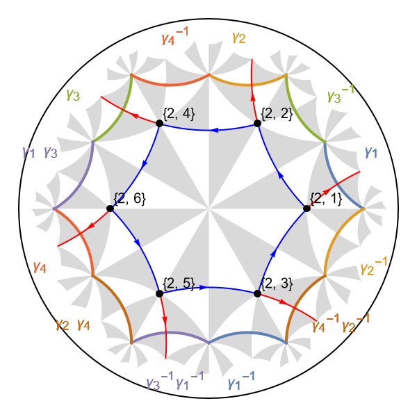
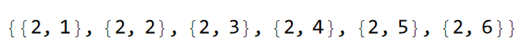
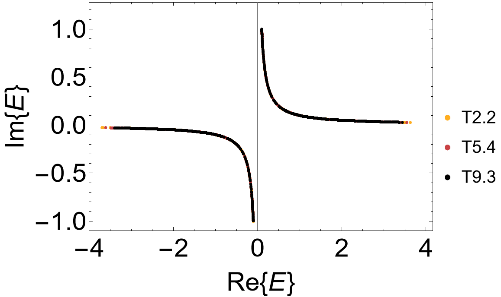
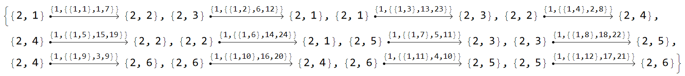
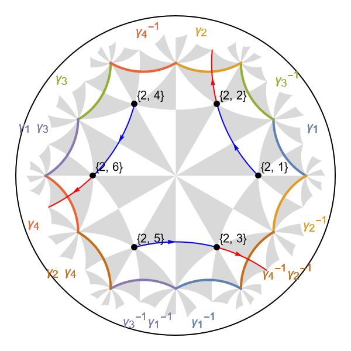
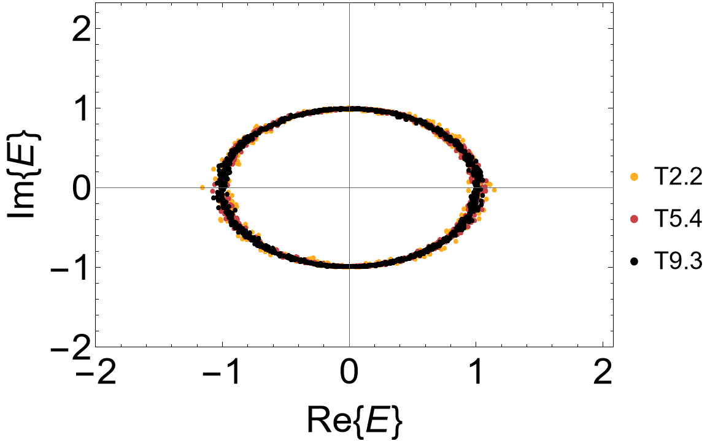

# Hatano-Nelson model

```{dropdown} Learning goals
:color: success
:icon: light-bulb

Construction of **non-Hermitian** Abelian Bloch Hamiltonians of:

* a tight-binding model with hermiticity breaking gains and losses
* and a variant of the Hatano-Nelson model for the {math}`\{6,4\}`-lattice.
```

```{dropdown}  Featured functions
:color: info
:icon: gear

**HyperCells:**

<code class="code-gap" style="font-size:1.1em;">
ProperTriangleGroup, TGQuotient, Export, TessellationModelGraph, TGQuotientSequencesAdjacencyMatrix, GetLongestSequence, TGCellSymmetric, TGSuperCellModelGraph
</code>
<br></br>

**HyperBloch:**

<code class="code-gap" style="font-size:1.1em;">
ImportCellGraphString, ImportModelGraphString, ImportSupercellModelGraphString, VisualizeModelGraph, ShowCellGraphFlattened, ShowCellBoundary, NonHermitianAbelianBlochHamiltonian, EdgeFilter
</code>
```

The HyperBloch package provides a framework for the construction of Abelian Bloch Hamiltonians of Hermitian as well as **non-Hermitian systems**. In principle, the workflow for the construction of non-Hermitian compared to Hermitian models is unchanged. However, particular attention is required when assigning coupling constants. In this tutorial we will see how non-Hermitian hyperbolic lattice models can be set up through the construction of nearest-neighbor tight-binding models on the {math}`\{6,4\}`-lattice. Specifically, we will consider hermiticity breaking terms, such as gains and losses, and a variant of the Hatano-Nelson model.


## Prerequisits

In order to construct the Abelian Bloch Hamiltonian for the two non-Hermitian models, we need to create the necessary files using the HyperCells package in **GAP**: 

```gap
# load the HyperCells package
LoadPackage( "HyperCells" );
tg := ProperTriangleGroup( [ 2, 4, 6 ] );

# Primitive cell:
# ---------------
qpc := TGQuotient( 1, [ 2, 4, 6 ] );
cgpc := TGCellGraph( tg, qpc, 3 : simplify := 5 );
Export( cgpc, "(2,4,6)_T2.2_3.hcc" ); # export

# specify underlying model graph
model := TessellationModelGraph(cgpc);
Export(model, "{6,4}-tess-NN_T2.2_3.hcm");
```

We choose a supercell sequence by following the central concepts discussed in the tutorial [Supercells](./Supercells.md) and [Coherent sequences](./Coherent_SC_sequences.md). The model specifications are inherited by subsequent supercell model graphs:

```gap
# Supercells:
# -----------
tgQAdjMat := TGQuotientSequencesAdjacencyMatrix(tg : boundByGenus := 10);;
sequence := GetLongestSequence(tgQAdjMat : quotient := 1);
sc_lst := sequence{[2..Length(sequence)]};

for sc_i_index in sc_lst do
    qsc_i := TGQuotient( sc_i_index );

    sc_i := TGCellSymmetric(tg, qsc_i, 3);
    scmodel_i := TGSuperCellModelGraph(model, sc_i);

    sc_i_label := StringFormatted("_T2.2_3_sc-T{}.{}.hcs", sc_i_index[1], sc_i_index[2]);
    scmodel_i_name := JoinStringsWithSeparator(["{6,4}-tess-NN", sc_i_label], "");
    Export(scmodel_i,  scmodel_i_name); # export file
od;
```

<div class="flex ">
  <a href="../../../source/assets/misc/code_snippets/Tutorials/HatanoNelsonModel/tutorial_HatanoNelsonModel_HyperCells_pc_sc_files.zip" class="btn btn-primary" class="flex-child"><i class="fa-solid fa-download"></i> Download generated files</a>
  <a href="../../../source/assets/misc/code_snippets/Tutorials/HatanoNelsonModel/tutorial_HatanoNelsonModel_HyperCells.g" class="btn btn-primary" class="flex-child"><i class="fa-solid fa-download"></i> Download GAP Code</a>
</div>
<br></br>

The files can be imported in **Mathematica** as usual:

```Mathematica
(* Labels and genera *)
cells = {"T2.2", "T5.4", "T9.3"}; 
genusLst = {2, 5, 9};

(* Import cell and model graph of the primitive cell *)
pcell = ImportCellGraphString[Import["(2,4,6)_T2.2_3.hcc"]];
pcmodel = ImportModelGraphString[Import["{6,4}-tess-NN_T2.2_3.hcm"]];

(* Import supercell model graph *)
scmodels = Association[# ->
      ImportSupercellModelGraphString[ 
       Import[
        ToString@StringForm["{6,4}-tess-NN_T2.2_3_sc-``.hcs", #]]]
     & /@ cells[[2 ;;]]];
```

It is useful to visualize the {math}`\{6,4\}`-tesselation model graph in order to properly assign the coupling constants:

```Mathematica
VisualizeModelGraph[pcmodel,
	Elements -> <|
		ShowCellGraphFlattened -> {},
		ShowCellBoundary -> {ShowEdgeIdentification -> True}
	|>, 
	CellGraph -> pcell,
	NumberOfGenerations -> 3,
	ImageSize -> 300
]
```

<figure class="text-center">
  <picture> 
    <source type="image/svg+xml" srcset="../../../source/assets/media/figs/Tutorials/HatanoNelson/{6,4}-tess-NN_pc_T2.2.png">
    
  </picture>
</figure>


## Non-Hermitian on-site terms

We choose to endow the {math}`\{6,4\}`-lattice with gains and losses by introducing a **staggered complex on-site potential**. Since the hyperbolic hexagons have an even number of sides the lattice can be considered as bipartite such that a sublattice mass can be realized with {math}`\pm (M + i \eta)`. It is instructive to take a look at the list of vertices in the model graph in order to identify the sub-lattices:

```Mathematica
VertexList@pcmodel["Graph"]
```

<figure class="text-center">
  <picture> 
    <source type="image/svg+xml" srcset="../../../source/assets/media/figs/Tutorials/HatanoNelson/vertices_{6,4}-tess-NN_pc_T2.2.png">
    
  </picture>
</figure>

By inspecting the list of vertices we are able to construct the corresponding association:

```Mathematica
mVec = (M + I eta) {1, -1, -1, 1, 1, -1}; 
onsitePC = AssociationThread[VertexList@pcmodel["Graph"] -> mVec];
```

Next, we set the nearest-neighbor hopping amplitudes to  <code class="code-Mathematica" style="font-size:1.1em;">-1</code>. The **non-Hermitian Abelian Bloch Hamiltonians** can be constructed by using the function <code class="code-Mathematica" style="font-size:1.1em;">NonHermitianAbelianBlochHamiltonian[]</code>, a generalization of the function <code class="code-Mathematica" style="font-size:1.1em;">AbelianBlochHamiltonian[]</code>. However, the generalized function takes into account the hopping direction of the interactions, such that **asymmetric hopping amplitudes** can be assigned (which will be considered later). This entails that we need to specify the hopping amplitude <code class="code-Mathematica" style="font-size:1.1em;">-1</code> twice:

```Mathematica
Hpc = NonHermitianAbelianBlochHamiltonian[pcmodel, 1, onsitePC, -1 &, -1 &, CompileFunction -> True];
```

and correspondingly for the supercells:

```Mathematica
Hclst =
  Join[Association["T2.2" -> Hpc],
   Association[# ->
       NonHermitianAbelianBlochHamiltonian[scmodels[#], 1, onsitePC, -1 &, -1 &, PCModel -> pcmodel, CompileFunction -> True]
      & /@ cells[[2 ;;]]]];
```

The supercell method can be applied as usual, where we use the function ComputeEigenvalues defined in the tutorial [Supercells](./Supercells.md):

```Mathematica
evals = Association[
   cells[[#]] -> 
      ComputeEigenvalues[
       Hclst[cells[[#]]] /. {M -> 0.1, eta -> 1}, 10^4, 32, genusLst[[#]]] & /@ Range[3]];
```

The complex spectrum can be visualized by using the built-in function <code class="code-Mathematica" style="font-size:1.1em;">ComplexListPlot</code> of Mathematica. However, this might take a few minutes to be displayed. As such let us thin down our data sets by taking smaller subsets through random samples:

```Mathematica
ComplexRandomThinning[evs_, Npts_] := Module[{keys},
  keys = Keys[evs];
  Association[
   Table[key -> RandomSample[Flatten[evs[key]], Npts],
    {key, keys}]]]
```

The complex spectrum exhibits a **line gap**:

```Mathematica
ComplexListPlot[ComplexRandomThinning[evals, 1000], PlotRange -> {{-4, 4}, {-1.1, 1.1}}, 
                FrameStyle -> Directive[Black, 30], Frame -> {{True, True}, {True, True}}, 
                FrameLabel -> {{"Im{E}", None}, {"Re{E}", None}}, AspectRatio -> 1/1.5,
                ImageSize -> 500, LabelStyle -> 20,  PlotMarkers -> {"\[FilledCircle]", Scaled[0.015]},
                PlotStyle -> (ColorData["SunsetColors", "ColorFunction"] /@ (1 - Range[1, 3]/3.)) ]
```


<figure class="text-center">
  <picture> 
    <source type="image/svg+xml" srcset="../../../source/assets/media/figs/Tutorials/HatanoNelson/spec_complex_64_onsite.png">
    
  </picture>
</figure>


## {math}`\{6,4\}`-Hatano-Nelson model

The variant of the Hatano-Nelson model we want to consider consists of one dimensional chains that are endowed with asymmetric hopping amplitudes. Each chain follows a hyperbolic geodesic and consists of a particular pair of vertices connected through direted edges in the model graph. Let us take a look at the list of edges:

```Mathematica
EdgeList@pcmodel["Graph"]
```

<figure class="text-center">
  <picture> 
    <source type="image/svg+xml" srcset="../../../source/assets/media/figs/Tutorials/HatanoNelson/edges_{6,4}-tess-NN_pc_T2.2.png">
    
  </picture>
</figure>

 We choose to asymmetrically couple the vertices  <code class="code-Mathematica" style="font-size:1.1em;">{{2,1},{2,2}}</code>, <code class="code-Mathematica" style="font-size:1.1em;">{{2,3},{2,5}}</code> and <code class="code-Mathematica" style="font-size:1.1em;">{{2,4},{2,6}}</code>. It is helpful to visualize the corresponding directed edges in the model graph by first defining the list:

```Mathematica
edgesInChains = {
    DirectedEdge[{2,1}, {2,2}], DirectedEdge[{2,2}, {2,1}], 
    DirectedEdge[{2,3}, {2,5}], DirectedEdge[{2,5}, {2,3}], 
    DirectedEdge[{2,4}, {2,6}], DirectedEdge[{2,6}, {2,4}]}
```

We can make use of the option <code class="code-Mathematica" style="font-size:1.1em;">EdgeFilter</code>  within the option <code class="code-Mathematica" style="font-size:1.1em;">ShowCellGraphFlattened</code> in the function <code class="code-Mathematica" style="font-size:1.1em;">VisualizeModelGraph[]</code> in order to visualize the corresponding one dimensional chains:

```Mathematica
VisualizeModelGraph[pcmodel,
 Elements -> <|
   ShowCellGraphFlattened -> {EdgeFilter -> (MemberQ[edgesInChains, #[[{1, 2}]]] &)},
   ShowCellBoundary -> {ShowEdgeIdentification -> True}
   |>,
 CellGraph -> pcell,
 NumberOfGenerations -> 3,
 ImageSize -> 300]
```

<figure class="text-center">
  <picture> 
    <source type="image/svg+xml" srcset="../../../source/assets/media/figs/Tutorials/HatanoNelson/1DChains_{6,4}-tess-NN_pc_T2.2.png">
    
  </picture>
</figure>

The hopping amplitudes can be assigned by inspecting the list of edges in the model graph, however, we may as well choose to proceed programmatically by filtering through the list:

```Mathematica
hoppingVecHatanoNelson = If[MemberQ[edgesInChains, #[[{1, 2}]]], 1, 0] & /@ EdgeList@pcmodel["Graph"];
```

In addition, we define another vector which we will use to (weakly) couple the Hatano-Nelson chains by symmetric hopping amplitudes:

```Mathematica
hoppingVecPerturbation = If[MemberQ[edgesInChains, #[[{1, 2}]]], 0, 1] & /@ EdgeList@pcmodel["Graph"];
```

Through the multiplication of the vector <code class="code-Mathematica" style="font-size:1.1em;">hoppingVecHatanoNelson</code> with the hopping amplitudes {math}`(t \pm \gamma)` in counter-clockwise and clockwise direction, respectively, we are able to realize the Hatano-Nelson chains. These chains can be coupled by adding the vector <code class="code-Mathematica" style="font-size:1.1em;">hoppingVecPerturbation</code> multiplied by the hopping amplitude {math}`\delta`:

```Mathematica
(* Counter-clockwise direction *)
hoppingVec1 = (t + gamma) hoppingVecHatanoNelson + delta  hoppingVecPerturbation;
hoppingsPC1 = AssociationThread[EdgeList@pcmodel["Graph"] -> hoppingVec1];

(* Clockwise direction *)
hoppingVec2 = (t - gamma) hoppingVecHatanoNelson + delta hoppingVecPerturbation;
hoppingsPC2 = AssociationThread[EdgeList@pcmodel["Graph"] -> hoppingVec2];
```

The non-Hermitian Abelian Bloch Hamiltonians for the primitive cell and supercells are constructed as follows: 

```Mathematica
Hpc = NonHermitianAbelianBlochHamiltonian[pcmodel, 1, 0 &, hoppingsPC1, hoppingsPC2, CompileFunction -> True];

Hclst =
  Join[Association["T2.2" -> Hpc],
   Association[# ->
       NonHermitianAbelianBlochHamiltonian[scmodels[#], 1, 0 &, hoppingsPC1, hoppingsPC2, PCModel -> pcmodel, CompileFunction -> True]
      & /@ cells[[2 ;;]]]];
```

The complex spectrum exhibits a **point gap**:

```Mathematica
evals = Association[
   cells[[#]] -> 
      ComputeEigenvalues[
       Hclst[cells[[#]]] /. {t -> 0.5, gamma -> 0.5, delta -> 0.1}, 10^4, 32, genusLst[[#]]] & /@ Range[3]];

ComplexListPlot[ComplexRandomThinning[evals, 1000], PlotRange -> {{-4, 4}, {-1.1, 1.1}}, 
                FrameStyle -> Directive[Black, 30], Frame -> {{True, True}, {True, True}}, 
                FrameLabel -> {{"Im{E}", None}, {"Re{E}", None}}, AspectRatio -> 1/1.5,
                ImageSize -> 500, LabelStyle -> 20,  PlotMarkers -> {"\[FilledCircle]", Scaled[0.015]},
                PlotStyle -> (ColorData["SunsetColors", "ColorFunction"] /@ (1 - Range[1, 3]/3.)) ]
```

<figure class="text-center">
  <picture> 
    <source type="image/svg+xml" srcset="../../../source/assets/media/figs/Tutorials/HatanoNelson/spec_complex_64_HatanoNelsonModel.png">
    
  </picture>
</figure>
