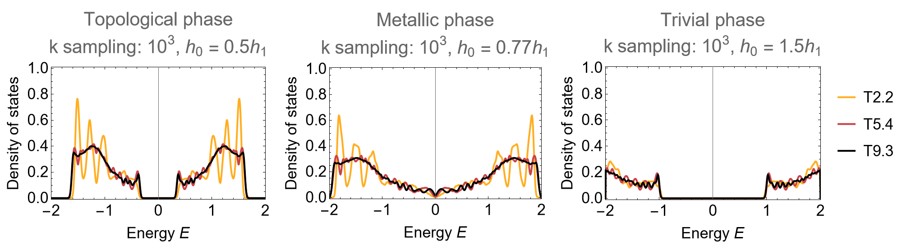
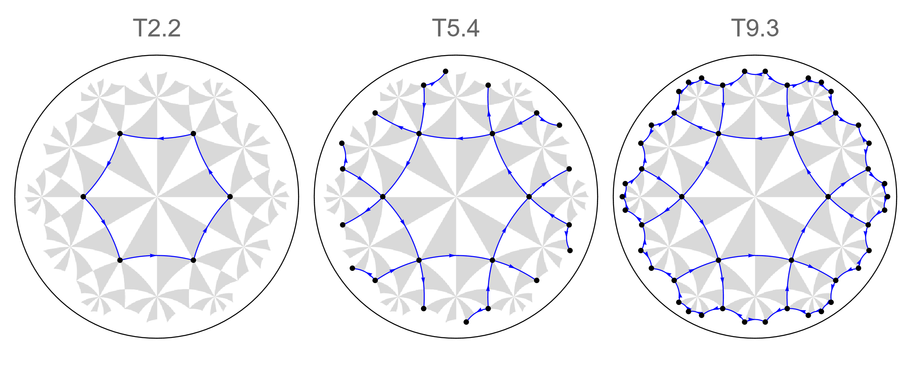
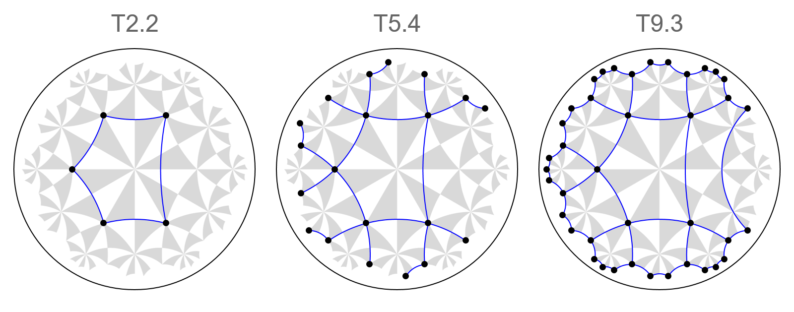

# Higher-order topology

```{dropdown} Learning goals
:color: success
:icon: light-bulb

* Lorem ipsum ... 
```

```{dropdown}  Featured functions
:color: info
:icon: gear

<code class="code-gap" style="font-size:1.1em;">Lorem ipsum ....</code>
```

Higher-order toplogical phases

## Multiple orbitals

```Mathematica
onsiteMat = {
   {0, 1, 0, 1},
   {1, 0, 1, 0},
   {0, 1, 0, 1},
   {1, 0, 1, 0}};

vertices = VertexList@pcmodel["Graph"];
onsitePC = AssociationThread[vertices -> ConstantArray[onsiteMat, Length@vertices]];
```

```Mathematica
hopMat1 = {
   {1, 0, 0, 0},
   {0, 0, 0, 1},
   {0, 0, 0, 0},
   {0, 0, 0, 0}};

hopMat2 = {
   {0, 0, 0, 0},
   {0, 0, 0, 1},
   {0, 0, 1, 0},
   {0, 0, 0, 0}};

hoppingsVec = {hopMat1, hopMat1, hopMat2, hopMat1, hopMat2, hopMat2, 
   hopMat1, hopMat2, hopMat1, hopMat2, hopMat1, hopMat2};

edges = EdgeList@pcmodel["Graph"];
hoppingsPC = AssociationThread[edges -> hoppingsVec];
```

## {math}`\{6,4\}`-BBH model

```Mathematica
onsiteMat = h0 {
    {  0,  1,  0, -1},
    {  1,  0,  1,  0},
    {  0,  1,  0,  1},
    { -1,  0,  1,  0}};

vertices = VertexList@pcmodel["Graph"];
onsitePC = AssociationThread[vertices -> ConstantArray[onsiteMat, Length@vertices]];
```

```Mathematica
hopMat2 = {
   {  0,  0,  0,  0},
   {  0,  0,  0,  1},
   {  0,  0, -1,  0},
   {  0,  0,  0,  0}};

hoppingsVec = 
  h1 {hopMat1, hopMat1, hopMat2, hopMat1, hopMat2, hopMat2, hopMat1, 
    hopMat2, hopMat1, hopMat2, hopMat1, hopMat2};

edges = EdgeList@pcmodel["Graph"];
hoppingsPC = AssociationThread[edges -> hoppingsVec];
```


<figure class="text-center">
  <picture> 
    <source type="image/svg+xml" srcset="../../../source/assets/media/figs/Tutorials/HOTI/dos_HOTI-64-BBH_scm.png">
    
  </picture>
</figure>

Note that at the gap closing  {math}`h_{0}=0.77 h_{1}` the transition for small supercells appears semi-metallic with vanishing DOS at {math}`E=0`. However,  the DOS converges to a finite value for larger supercells, which implies that this is a finite-size effect.


## Disclinations


<figure class="text-center">
  <picture> 
    <source type="image/svg+xml" srcset="../../../source/assets/media/figs/Tutorials/HOTI/{6,4}-finitie_flakes_regular.png">
    
  </picture>
</figure>

<figure class="text-center">
  <picture> 
    <source type="image/svg+xml" srcset="../../../source/assets/media/figs/Tutorials/HOTI/{6,4}-finitie_flakes_disclination.png">
    
  </picture>
</figure>

