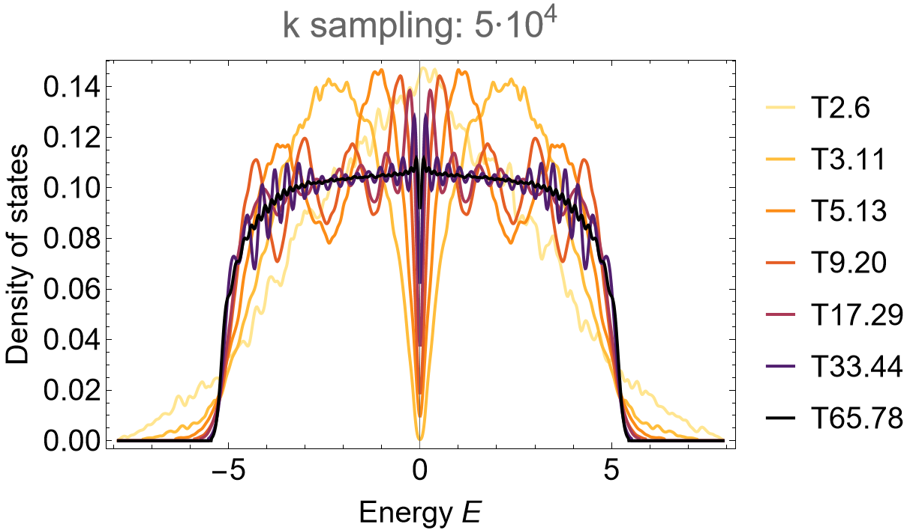

# Supercells

```{dropdown} Learning goals
:color: success
:icon: light-bulb

* Construction of a supercell sequence.
* Application of the supercell method. 
```

```{dropdown}  Featured functions
:color: info
:icon: gear

**HyperCells:**

<code class="code-gap" style="font-size:1.1em;">
ProperTriangleGroup, TGQuotient, TGCellGraph, TessellationModelGraph, Export, TGCellSymmetric, TGSuperCellModelGraph
</code>
<br></br>

**HyperBloch:**

<code class="code-gap" style="font-size:1.1em;">
ImportModelGraphString, AbelianBlochHamiltonian, ImportSupercellModelGraphString
</code>
```

The HyperCells package provides a framework for an efficient construction of **supercells**. These supercells are formed by aggregates of primitive cells into larger unit cells. Particular **sequences** of supercells enable the application of the **supercell method**, which let us access higher dimensional irreducible representations on the original primitive cell through Abelian hyperbolic band theory implemented in the HyperBloch package. 

## Constructing a supercell sequence

Appropriate supercell sequences are restricted to so-called **coherent sequences**, the workflow to identify such sequences will be discussed in more depth in the next tutorial [Coherent sequences](./Coherent_SC_sequences.md). So long, let us construct an appropriate supercell sequence in order to use the supercell method for hyperbolic lattices on tight-binding models.

Previously, in [Getting started with HyperCells](../GettingStarted/getSetGo_HyperCells.md) and [Getting started with HyperBloch](../GettingStarted/getSetGo_HyperBloch.md), we have seen how a primitive cell and a particular supercell on the {math}`\{8,8\}`-lattice can be constructed. This minimal sequence can be extended by considering higher order quotient groups {math}`\Delta^{+}/\Gamma^{(m)}` in order to construct **m-supercells**. We choose the following supercell sequence identified with quotient groups in  <a target="_blank" href="https://patrick-lenggenhager.github.io/HyperCells/doc/chapBib_mj.html#biBConder:2007">Marston Conder's</a> list:

<p style="text-align: center;">
<code class="code-gap" style="font-size:1.1em;">T2.6</code>, <code class="code-gap" style="font-size:1.1em;">T3.11</code>, <code class="code-gap" style="font-size:1.1em;">T5.13</code>, <code class="code-gap" style="font-size:1.1em;">T9.20</code>, <code class="code-gap" style="font-size:1.1em;">T17.29</code>, <code class="code-gap" style="font-size:1.1em;">T33.44</code> and <code class="code-gap" style="font-size:1.1em;">T65.78</code> 
</p>

They are denoted as <code class="code-gap" style="font-size:1.1em;">Tg.n</code>, where <code class="code-gap" style="font-size:1.1em;">g</code> is the genus of the corresponding closed Riemann surface they act upon and <code class="code-gap" style="font-size:1.1em;">n</code> is the <code class="code-gap" style="font-size:1.1em;">n</code>'th quotient group with that genus. The primitive cell is identified with the quotient <code class="code-gap" style="font-size:1.1em;">T2.6</code>.

First, let us construct the proper triangle group {math}`\Delta^{+}` together with the primitive cell <code class="code-gap" style="font-size:1.1em;">T2.6</code> and the model graph, based on the tessellation graph, in **GAP**:

```gap
# load the HyperCells package
LoadPackage( "HyperCells" );

# set up proper triangle group
tg := ProperTriangleGroup( [ 2, 8, 8 ] );

# Primitive cell:
# ---------------

# specify the quotient defining the primitive cell
qpc := TGQuotient( [ 2, 6 ], [ 2, 8, 8 ] );

# construct symmetric primitive cell
cgpc := TGCellGraph( tg, qpc, 3 : simplify := 5 );

# elementary nearest-neighbor model
model := TessellationModelGraph( cgpc, true : simplify := 5 );
Export( model, "{8,8}-tess_T2.6_3.hcm" ); # export
```

The nearest-neighbor supercell model graphs for the {math}`\{8,8\}`-tessellation of the hyperbolic plane are easily extracted by iterating over the list of quotients <code class="code-gap" style="font-size:1.1em;">sc_lst</code> that specify our choosen supercell sequence:

```gap
# Supercells:
# -----------

sc_lst := [[3, 11], [5, 13], [9, 20], [17, 29], [33, 44], [65, 78]];

for sc_i_index in sc_lst do
  
  # quotient group 
  qsc_i := TGQuotient( sc_i_index );

  # construct tessellation graphs
  sc_i := TGCellSymmetric(tg, qsc_i, 3);
  scmodel_i := TGSuperCellModelGraph(model, sc_i);

  # export file
  sc_i_label := StringFormatted("-tess_T2.6_3_sc-T{}.{}.hcs", sc_i_index[1], sc_i_index[2]);
  scmodel_i_name := JoinStringsWithSeparator(["{8,8}", sc_i_label], "");
  Export(scmodel_i,  scmodel_i_name);
od;
```

<div class="flex ">
  <a href="../../../source/assets/misc/code_snippets/Tutorials/Supercells/tutorial_Supercells_HyperCells_pc_sc_files.zip" class="btn btn-primary" class="flex-child"><i class="fa-solid fa-download"></i> Download generated files</a>
  <a href="../../../source/assets/misc/code_snippets/Tutorials/Supercells/tutorial_Supercells_HyperCells_sc.g" class="btn btn-primary" class="flex-child"><i class="fa-solid fa-download"></i> Download GAP Code</a>
</div>
<br>

We are now ready to apply the **supercell method** in **Mathematica** using the HyperBloch package. First, we import the primitive cell model graph and construct the Abelian Bloch Hamiltonian for the nearest-neighbor tight-binding model:

```Mathematica
(* Preliminaries *)
<< PatrickMLenggenhager`HyperBloch`
SetDirectory[NotebookDirectory[]];
 
(* Import primitive cell model *)
pcmodel = ImportModelGraphString[Import["{8,8}-tess_T2.6_3.hcm"]];

(* Hamiltonian for the primitive cell *)
Hpc = AbelianBlochHamiltonian[pcmodel, 1, 0 &, -1 &, CompileFunction -> True];
```

Next, it is convinient to import the supercell model graph and construct the corresponding Hamiltonians by using associations:

```Mathematica
(* Labels *)
cells = {"T2.6", "T3.11", "T5.13", "T9.20", "T17.29", "T33.44", "T65.78"};

(* Import supercell models *)
scmodels = Association[# -> 
  ImportSupercellModelGraphString[ Import[ 
    StringForm["{8,8}-tess_T2.6_3_sc-``.hcs", #]
]] & /@ cells[[2 ;;]] ];

(* Hamiltonian for the supercells *)
Hscs = Association[# -> 
  AbelianBlochHamiltonian[scmodels[#], 1, 0 &, -1 &,PCModel -> pcmodel,CompileFunction -> True]
  &/@ cells];
```

and:

```Mathematica
(* All *)
cmodels = Join[Association[cells[[1]] -> pmodelc], scmodels];
Hclst = Join[Association[cells[[1]] -> Hpc], Hscs];
```

We can extract the genera of the Rieman surfaces, which the quotient groups act upon, by using the key <code class="code-Mathematica" style="font-size:1.1em;">"Genus"</code> of the imported model graphs:

```Mathematica
genusLst = cmodels[#]["Genus"] &/@ cells;
```

The supercell method applied on this sequence captures some of the higher-dimensional irreducible representations on the original primitive cell. We can take advantage of the independence of different momentum sectors and parallelize the computation of the density of states. This can be done as follows:

```Mathematica
ComputeEigenvalues[cfH_, Npts_, Nruns_, genus_] :=
 Flatten@ParallelTable[
  Flatten@Table[
    Eigenvalues[cfH @@ RandomReal[{-Pi, Pi}, 2 genus]], 
    {i, 1, Round[Npts/Nruns]}],
  {j, 1, Nruns}, Method -> "FinestGrained"]

(* Compute the Eigenvalues *)
evals = Association[cells[[#]] -> 
  ComputeEigenvalues[Hclst[cells[[#]]], 5*10^4, 32, genusLst[[#]] ] &/@ Range[7]];
```

We can nicely observe the convergence of the DOS:

```Mathematica
SmoothHistogram[evals, 0.05, "PDF", Frame -> True, FrameStyle -> Black, 
                FrameLabel -> {"Energy E", "Density of states"}, 
                PlotRange -> All, ImageSize -> 500, LabelStyle -> 20,
                PlotLabel -> "k sampling: 5*10^4", PlotStyle -> 
                (ColorData["SunsetColors", "ColorFunction"] /@ (1-Range[1, 7]/7.)),
                ImagePadding -> {{Automatic, 10}, {Automatic, 10}}]
```

<figure class="text-center">
  <picture> 
    <source type="image/svg+xml" srcset="../../../source/assets/media/figs/Tutorials/Supercells/dos_88_scm1.png">
    
  </picture>
</figure>

## Alternative supercell sequences

Let us also consider alternative sequences of supercells to verify the independence of the thermodynamic limit on the particular choice of sequence. We choose to construct two alternative sequences:

<p style="text-align: center;">
<code class="code-gap" style="font-size:1.1em;">T3.10</code>, <code class="code-gap" style="font-size:1.1em;">T5.13</code>, <code class="code-gap" style="font-size:1.1em;">T9.22</code>, <code class="code-gap" style="font-size:1.1em;">T17.35</code>, <code class="code-gap" style="font-size:1.1em;">T33.58</code> and <code class="code-gap" style="font-size:1.1em;">T65.81</code> 
</p>

and

<p style="text-align: center;">
<code class="code-gap" style="font-size:1.1em;">T5.12</code>, <code class="code-gap" style="font-size:1.1em;">T9.22</code>, <code class="code-gap" style="font-size:1.1em;">T17.32</code>, <code class="code-gap" style="font-size:1.1em;">T33.46</code> and <code class="code-gap" style="font-size:1.1em;">T65.79</code> 
</p>

In order to obtain the density of states, the previous steps for the first sequence can be repeated, resulting in: 

```Mathematica
SmoothHistogram[evals, 0.05, "PDF", Frame -> True, FrameStyle -> Black, 
                FrameLabel -> {"Energy E", "Density of states"}, 
                PlotRange -> {{-8, 8}, Automatic},ImageSize -> 500, LabelStyle -> 20,
                PlotLabel -> "k sampling: 5*10^4", PlotStyle -> 
                (ColorData["SunsetColors", "ColorFunction"] /@ (1-Range[1, 6]/6.)),
                ImagePadding -> {{Automatic, 10}, {Automatic, 10}}]
```

<figure class="text-center">
  <picture> 
    <source type="image/svg+xml" srcset="../../../source/assets/media/figs/Tutorials/Supercells/dos_88_alt_scm1.png">
    
  </picture>
</figure>

and:
```Mathematica
SmoothHistogram[evals, 0.05, "PDF", Frame -> True, FrameStyle -> Black, 
                FrameLabel -> {"Energy E", "Density of states"}, 
                PlotRange -> {{-8,8} ,Automatic}, ImageSize -> 500, LabelStyle -> 20,
                PlotLabel -> "k sampling: 5*10^4", PlotStyle -> 
                (ColorData["SunsetColors", "ColorFunction"] /@ (1-Range[1, 5]/5.)),
                ImagePadding -> {{Automatic, 10}, {Automatic, 10}}]
```

<figure class="text-center">
  <picture> 
    <source type="image/svg+xml" srcset="../../../source/assets/media/figs/Tutorials/Supercells/dos_88_alt_scm2.png">
    
  </picture>
</figure>

<div style="text-align: right;">
  <a href="../../../source/assets/misc/code_snippets/Tutorials/Supercells/tutorial_Supercells_HyperBloch.nb" class="btn btn-primary"><i class="fa-solid fa-download"></i> Download Mathematica Notebook</a>
</div>
