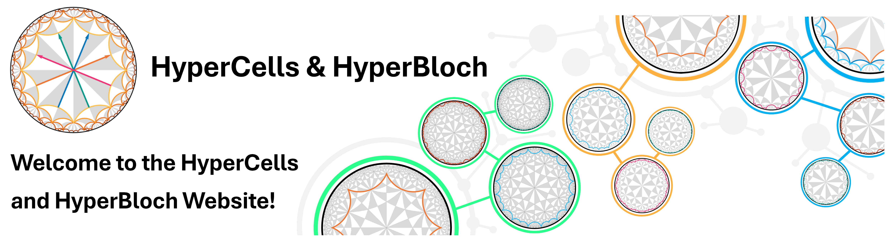

:html_theme.sidebar_secondary.remove: true

.. 
   HyperCells website documentation master file, created by
   sphinx-quickstart on Mon Jun 24 10:13:57 2024.
   You can adapt this file completely to your liking, but it should at least
   contain the root `toctree` directive.

.. raw:: html

    

.. raw:: html

   

.. raw:: html

   
  <link rel="preload" href="_static/images/darkMode/TitleFigure2.2_dark.png" as="image">

.. grid:: 3
   :gutter: 2
   :padding: 0
   :margin: 4 2 0 0

   .. grid-item-card:: Installation
      :link: ./contents/Installation/installation.html
      :link-alt: installation.html

   .. grid-item-card:: Getting started
      :link: getsetgo
      :link-type: ref
      :link-alt: clickable cards

   .. grid-item-card:: Tutorials
      :link: tutorials
      :link-type: ref
      :link-alt: clickable cards

.. card:: Documentation
   :link: ./contents/Documentation/documentation.html
   :link-alt: clickable cards
   :text-align: center
   :margin: 0 4 0 0

.. |GAP| raw:: html

   <a href="https://www.gap-system.org/" target="_blank">GAP</a>

.. |Mathematica| raw:: html

   <a href="https://www.wolfram.com/mathematica" target="_blank">Mathematica</a>

.. highlights::
   **HyperCells** is a |GAP| package for constructing and working with the graphs underlying
   infinite and compactified hyperbolic lattices and their (translation) symmetries.
   This is achieved through the hyperbolic lattices' structure as Cayley graphs of triangle
   groups and their quotients with normal subgroups.

.. highlights::
   **HyperBloch** is a |Mathematica| package for defining tight-binding models on infinite
   and compactified hyperbolic lattices, computing their Bloch Hamiltonians, and obtaining
   the corresponding eigenstates and spectrum based on hyperbolic band theory and the supercell
   method.
   Additionally, it enables advanced visualizations of compactified hyperbolic lattices and
   tight-binding models defined on them in the Poincaré disk model.

======

Overview
--------

.. |Phys. Rev. Lett. 131, 226401 (2023)| raw:: html

   <a href="https://doi.org/10.1103/PhysRevLett.131.226401" target="_blank">Phys. Rev. Lett. 131, 226401 (2023)</a>

.. |PhD thesis| raw:: html

   <a href="https://doi.org/10.3929/ethz-b-000645370" target="_blank">PhD thesis</a>

.. |library of graphs| raw:: html

   <a href="https://github.com/HyperCells/cell-graph-library" target="_blank">library of graphs</a>

.. |documentation on the file format| raw:: html

   <a href="https://www.hypercells.net/HyperCells/doc/chap8_mj.html" target="_blank">documentation on the file format</a>

.. |space| unicode:: U+2064 .. space

Hyperbolic lattices are symmetric tessellations of the hyperbolic plane, i.e., the space of
constant negative curvature.
Due to their non-Euclidean geometry, the translations of hyperbolic lattices do not commute,
which poses a challenge for the analytical description of models defined on them.
Already constructing lattices with periodic boundary conditions is nontrivial, and doing it
in a way that ensures convergence to the thermodynamic limit is even more challenging.
Furthermore, the noncommutativity of translations severely complicates a momentum-space
description.

This is where **HyperCells** and **HyperBloch** come into play.
**HyperCells** provides the necessary tools to construct the graphs underlying hyperbolic lattices
and their symmetries, while **HyperBloch** enables the computation of Bloch Hamiltonians through
the **supercell method** (see next page).
An accessible introduction to the topic in general and underlying methods, is provided, for
example, in Dr. Patrick M. Lenggenhager's |PhD thesis|.

This website serves as a comprehensive guide to the installation and usage of both packages,
providing tutorials with detailed explanations ranging from simple examples to more advanced
applications.
The software packages are open-source and available on GitHub, where contributions, both
reports of bugs and code contributions, are welcome.
While most tutorials focus on examples from condensed matter physics and the supercell method,
**HyperCells** has a much broader scope and can be used anywhere where hyperbolic lattices
and their symmetries are of interest, independent of a potential momentum-space description.

We also provide a Github repository with a |library of graphs| generated with **HyperCells**,
which can be used without the need to install the package.
Check out the |documentation on the file format| to use them in your own projects.
Alternatively, you can import them in Mathematica using the **HyperBloch** package.

.. toctree::
   :maxdepth: 10
   :caption: Contents:
   :hidden:

   contents/About/about.rst

   contents/Installation/installation.md

   contents/GettingStarted/getting_started.rst
      
   contents/Tutorials/tutorials.rst

   contents/Documentation/documentation.md

   contents/Contribute/contribute.rst

   contents/Cite/cite.md

   contents/LicenseCopyright/licenseCopyright.md

..
   contents/Gallery/gallery.rst

   contents/Contact/contact.md

   contents/Publications/publications.md

   contents/Releases/releases.md

..
   Indices and tables
   ------------------

   * :ref:`genindex`
   * :ref:`modindex`
   * :ref:`search`
